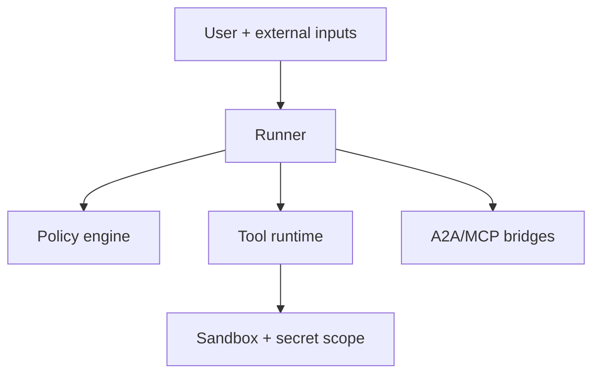

## Security boundaries

## Default posture

- treat model/tool outputs as untrusted
- validate payloads before execution
- gate privileged actions via policy decisions
- isolate secrets and command capabilities per tool call

## Production checklist

<Steps>
  <Step title="Auth hardening">
    Use strict A2A auth providers in production.
  </Step>
  <Step title="Tool hardening">
    Restrict allowlists and enforce sandbox profiles.
  </Step>
  <Step title="Auditability">
    Persist policy decisions and terminal failures.
  </Step>
</Steps>
