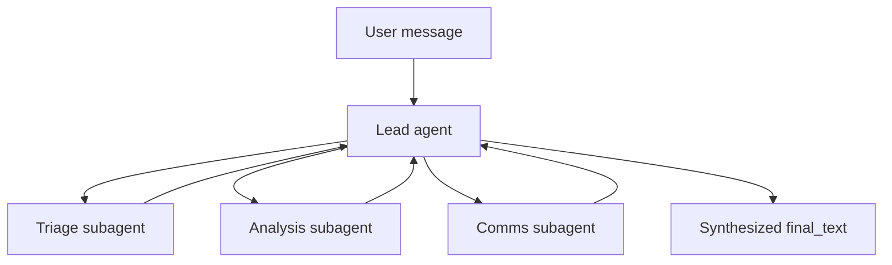

When a task is too complex for a single agent, AFK supports delegating subtasks to specialist subagents. The coordinator (or "lead") agent decides what to delegate, and the runner handles dispatching work to subagents, collecting their results, and feeding those results back to the coordinator for synthesis.

This pattern is useful for incident response, research workflows, content pipelines, and any scenario where different aspects of a task require distinct expertise or instructions.

## Delegation flow



## Example

```python
from afk.agents import Agent
from afk.core import Runner

# Define specialist subagents
triage = Agent(
    name="triage",
    model="gpt-4.1-mini",
    instructions="Classify incident severity as SEV1, SEV2, SEV3, or SEV4 based on the description.",
)
analysis = Agent(
    name="analysis",
    model="gpt-4.1-mini",
    instructions="Identify the most likely root causes for the described incident.",
)
comms = Agent(
    name="comms",
    model="gpt-4.1-mini",
    instructions="Draft a concise stakeholder update email summarizing the incident and current status.",
)

# Define the coordinator agent
lead = Agent(
    name="lead",
    model="gpt-4.1-mini",
    instructions="Delegate to specialists and synthesize their outputs into a final response.",
    subagents=[triage, analysis, comms],
)

runner = Runner()
result = runner.run_sync(lead, user_message="Investigate API latency spike and draft update")
print(result.final_text)
```

## How the coordinator pattern works

1. The **lead agent** receives the user message and decides how to delegate. It can invoke subagents through tool-like calls that the runner intercepts.

2. The **runner** dispatches each subagent invocation as a separate run. Subagents execute independently with their own instructions and model configuration. The runner manages concurrency, timeout, and failure handling for each subagent.

3. **Subagent results** are returned to the lead agent as execution records. Each record contains the subagent's `final_text`, terminal `state`, and optional error information.

4. The **lead agent** receives all subagent outputs and synthesizes them into a unified response. This final synthesis step is what produces the coordinator's `final_text`.

## What subagent_executions contains

The `AgentResult` returned by the lead agent includes a `subagent_executions` list. Each entry is a `SubagentExecutionRecord` with:

| Field | Type | Description |
| --- | --- | --- |
| `agent_name` | `str` | Name of the subagent that was invoked. |
| `success` | `bool` | Whether the subagent completed successfully. |
| `final_text` | `str or None` | The subagent's response text, if it completed. |
| `state` | `str` | Terminal state of the subagent run. |
| `latency_ms` | `float` | Wall-clock execution time in milliseconds. |
| `error` | `str or None` | Error message if the subagent failed. |

You can inspect these records to understand what each subagent contributed:

```python
result = runner.run_sync(lead, user_message="Investigate API latency spike")

for execution in result.subagent_executions:
    status = "OK" if execution.success else "FAILED"
    print(f"  [{status}] {execution.agent_name}: {execution.final_text[:80]}...")
```

## Subagent failure handling

By default, if a subagent fails, the entire run fails. You can configure more resilient behavior using `FailSafeConfig`:

```python
from afk.agents import FailSafeConfig

lead = Agent(
    name="lead",
    model="gpt-4.1-mini",
    instructions="Delegate to specialists. If any specialist fails, work with available results.",
    subagents=[triage, analysis, comms],
    fail_safe=FailSafeConfig(
        subagent_failure_policy="degrade",  # Continue with partial results
        max_subagent_depth=3,               # Prevent deep recursion
    ),
)
```

With `subagent_failure_policy="degrade"`, the lead agent receives the error information for failed subagents alongside successful results, and can produce a best-effort synthesis.
