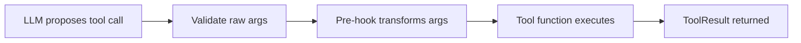

## What this snippet demonstrates

AFK provides two distinct hook/middleware systems that operate at different layers:

1. **Tool hooks and middleware** -- Pre-hooks, post-hooks, and middleware that wrap individual tool executions. These use Pydantic models for typed arguments and run inside the tool execution pipeline.

2. **LLM middleware** -- Middleware that wraps LLM client operations (chat, stream, embed). These intercept requests and responses at the provider transport layer.

Both systems follow the same pattern: define a callable, wire it into the pipeline, and the runner executes it at the appropriate point in the lifecycle.

## Tool pre-hooks

A pre-hook runs before the main tool function executes. It receives the tool's arguments (validated against its own Pydantic model) and returns a dictionary of transformed arguments that the main tool will receive. Use pre-hooks for input sanitization, enrichment, or validation that should happen before execution.

```python
from pydantic import BaseModel, Field
from afk.tools.core.decorator import tool, prehook


# Pre-hook argument model matches the main tool's argument shape
class SearchArgs(BaseModel):
    query: str
    max_results: int = Field(default=10, ge=1, le=100)


# Pre-hook: sanitize and normalize the query before the tool runs
@prehook(args_model=SearchArgs, name="normalize_query")
async def normalize_query(args: SearchArgs) -> dict:
    """Strip extra whitespace and lowercase the query."""
    return {
        "query": " ".join(args.query.lower().split()),
        "max_results": min(args.max_results, 50),  # Cap at 50
    }


# Main tool with the pre-hook attached
@tool(
    args_model=SearchArgs,
    name="search_docs",
    description="Search the documentation index.",
    prehooks=[normalize_query],
)
async def search_docs(args: SearchArgs) -> dict:
    # args.query is already normalized by the pre-hook
    return {"results": [f"Result for: {args.query}"], "count": args.max_results}
```

### Pre-hook execution flow



The pre-hook receives validated arguments and must return a dictionary compatible with the main tool's `args_model`. If the returned dictionary fails validation against the tool's model, the tool call fails with a `ToolValidationError`.

## Tool post-hooks

A post-hook runs after the main tool function completes. It receives the tool output and can transform or annotate the result before it is returned to the LLM. Use post-hooks for output sanitization, logging, or enrichment.

```python
from pydantic import BaseModel
from typing import Any
from afk.tools.core.decorator import posthook


class PostHookArgs(BaseModel):
    output: Any
    tool_name: str | None = None


@posthook(args_model=PostHookArgs, name="redact_sensitive")
async def redact_sensitive(args: PostHookArgs) -> dict:
    """Remove sensitive fields from tool output before returning to LLM."""
    output = args.output
    if isinstance(output, dict):
        # Strip any fields that might contain secrets
        sanitized = {
            k: v for k, v in output.items()
            if k not in ("api_key", "secret", "password", "token")
        }
        return {"output": sanitized, "tool_name": args.tool_name}
    return {"output": output, "tool_name": args.tool_name}
```

AFK passes post-hooks a payload dictionary with the shape `{"output": <tool_output>, "tool_name": "<tool_name>"}`. The post-hook must return a dictionary with the same shape.

## Tool-level middleware

Tool-level middleware wraps around the entire tool execution, including pre-hooks and post-hooks. Middleware receives a `call_next` function and the tool arguments, and can modify behavior before, after, or around execution.

```python
from afk.tools.core.decorator import middleware


@middleware(name="timing_middleware")
async def timing_middleware(call_next, args, ctx):
    """Measure and log tool execution time."""
    import time
    start = time.monotonic()
    result = await call_next(args, ctx)
    elapsed_ms = (time.monotonic() - start) * 1000
    print(f"Tool executed in {elapsed_ms:.1f}ms")
    return result


@middleware(name="retry_on_transient")
async def retry_on_transient(call_next, args, ctx):
    """Retry the tool once on transient errors."""
    try:
        return await call_next(args, ctx)
    except ConnectionError:
        # One retry on connection errors
        return await call_next(args, ctx)
```

### Attaching middleware to a tool

```python
@tool(
    args_model=SearchArgs,
    name="search_docs",
    description="Search the documentation index.",
    prehooks=[normalize_query],
    posthooks=[redact_sensitive],
    middlewares=[timing_middleware, retry_on_transient],
)
async def search_docs(args: SearchArgs) -> dict:
    return {"results": [...]}
```

Middleware executes in the order listed. The first middleware in the list is the outermost wrapper. Each middleware calls `call_next` to pass control to the next middleware (or the actual tool function if it is the last one).

## Registry-level middleware

Registry-level middleware applies to every tool in a `ToolRegistry`, not just a single tool. Use this for cross-cutting concerns like audit logging, rate limiting, or policy enforcement that should apply uniformly.

```python
from afk.tools.core.decorator import registry_middleware


@registry_middleware(name="audit_log")
async def audit_log(call_next, tool, raw_args, ctx):
    """Log every tool invocation for audit purposes."""
    print(f"AUDIT: tool={tool.spec.name} args={raw_args}")
    result = await call_next(tool, raw_args, ctx)
    print(f"AUDIT: tool={tool.spec.name} success={result.success}")
    return result
```

## LLM client middleware

LLM middleware operates at the provider transport layer, intercepting requests to and responses from the LLM API. AFK defines three middleware protocols for the three LLM operations:

```python
from afk.llms import LLMBuilder, LLMRequest, LLMResponse
from afk.llms.middleware import MiddlewareStack


# Chat middleware: intercepts non-streaming chat requests
async def add_request_metadata(call_next, req: LLMRequest) -> LLMResponse:
    """Add tracing metadata to every LLM request."""
    req.metadata = req.metadata or {}
    req.metadata["trace_id"] = "trace_abc123"
    return await call_next(req)


# Build client with middleware
client = (
    LLMBuilder()
    .provider("openai")
    .model("gpt-4.1-mini")
    .profile("production")
    .with_middlewares(MiddlewareStack(
        chat=[add_request_metadata],
        embed=[],
        stream=[],
    ))
    .build()
)
```

### LLM middleware protocols

| Protocol | Operation | Signature |
| --- | --- | --- |
| `LLMChatMiddleware` | Non-streaming chat | `async (call_next, req: LLMRequest) -> LLMResponse` |
| `LLMEmbedMiddleware` | Embeddings | `async (call_next, req: EmbeddingRequest) -> EmbeddingResponse` |
| `LLMStreamMiddleware` | Streaming chat | `(call_next, req: LLMRequest) -> AsyncIterator[LLMStreamEvent]` |

Each middleware receives `call_next` (the next middleware or transport in the chain) and the request object. It can modify the request before calling `call_next`, modify the response after, or short-circuit entirely by returning a response without calling `call_next`.

## When to use each layer

| Layer | Scope | Use for |
| --- | --- | --- |
| **Tool pre-hook** | Single tool, before execution | Input sanitization, argument enrichment, validation |
| **Tool post-hook** | Single tool, after execution | Output sanitization, redaction, annotation |
| **Tool middleware** | Single tool, wraps execution | Timing, retries, caching, error handling |
| **Registry middleware** | All tools in registry | Audit logging, rate limiting, policy enforcement |
| **LLM middleware** | All LLM calls through client | Request metadata, response logging, tracing |

## What to read next

- [Tools](/library/tools) -- Full tool system architecture, the 6-step execution pipeline, and design guidelines.
- [Tool Call Lifecycle](/library/tool-call-lifecycle) -- Detailed lifecycle of a tool call from LLM proposal to result delivery.
- [LLMs Overview](/llms/index) -- Builder workflow, runtime profiles, and provider selection.
