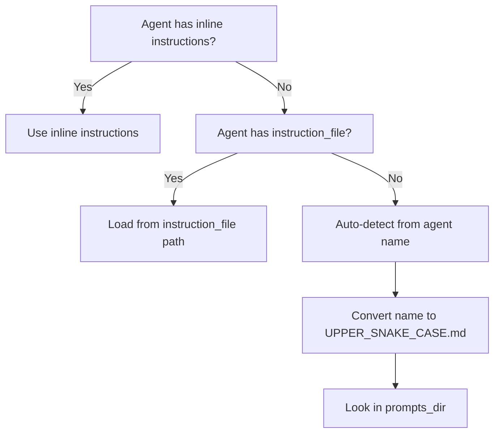

## What this snippet demonstrates

AFK agents need system prompts (instructions) that tell the LLM how to behave. Rather than hardcoding instructions as inline strings, AFK provides a file-based prompt resolution system that loads prompts from a directory hierarchy. This keeps prompts version-controlled, editable by non-developers, and reusable across agents.

The prompt loader resolves instructions through a deterministic precedence chain, supports Jinja2 templating for dynamic prompts, and caches compiled templates using stat-based invalidation for hot-reload during development.

## Resolution precedence

The prompt system resolves agent instructions through this priority chain:



1. **Inline `instructions`** -- If the agent has a non-empty `instructions` string, it is used directly. No file loading occurs.
2. **Explicit `instruction_file`** -- If set, the file is loaded from the configured `prompts_dir`. The path must resolve to a file inside the prompts root (no directory traversal).
3. **Auto-detected file** -- If neither is set, the agent's name is converted to `UPPER_SNAKE_CASE.md` and loaded from `prompts_dir`.

## Basic usage

```python
from afk.agents import Agent

# Option 1: Inline instructions (highest priority)
agent = Agent(
    name="ChatAgent",
    model="gpt-4.1-mini",
    instructions="Answer customer questions concisely.",
)

# Option 2: Explicit instruction file
agent = Agent(
    name="ChatAgent",
    model="gpt-4.1-mini",
    instruction_file="chat_agent_system.md",   # Loaded from prompts_dir
    prompts_dir=".agents/prompt",
)

# Option 3: Auto-detected file (uses agent name)
# Loads .agents/prompt/CHAT_AGENT.md automatically
agent = Agent(
    name="ChatAgent",
    model="gpt-4.1-mini",
    prompts_dir=".agents/prompt",
)
```

## Name-to-filename conversion

The auto-detection algorithm converts the agent name to a filename using these rules:

| Agent Name | Derived Filename | Rule Applied |
| --- | --- | --- |
| `ChatAgent` | `CHAT_AGENT.md` | CamelCase split on boundaries |
| `chatagent` | `CHAT_AGENT.md` | Lowercase `agent` suffix detected and split |
| `research-assistant` | `RESEARCH_ASSISTANT.md` | Hyphens replaced with underscores |
| `QA Bot v2` | `QA_BOT_V2.md` | Spaces and non-alphanumeric chars become underscores |

The conversion is handled by `derive_auto_prompt_filename()` internally. It splits camelCase boundaries, normalizes non-alphanumeric characters to underscores, collapses consecutive underscores, and uppercases the result.

## Prompts directory resolution

The prompts directory is resolved through its own priority chain:

1. Explicit `prompts_dir` argument on the `Agent` constructor.
2. `AFK_AGENT_PROMPTS_DIR` environment variable.
3. Default: `.agents/prompt` relative to the current working directory.

```python
# Explicit
agent = Agent(name="Bot", model="gpt-4.1-mini", prompts_dir="/opt/prompts")

# Environment variable
# export AFK_AGENT_PROMPTS_DIR=/opt/prompts
agent = Agent(name="Bot", model="gpt-4.1-mini")

# Default: .agents/prompt/
agent = Agent(name="Bot", model="gpt-4.1-mini")
```

## Jinja2 templating

Prompt files support Jinja2 template syntax. When the runner resolves a prompt, it renders the template with a context dictionary that includes agent metadata and any custom context passed to the run.

**File: `.agents/prompt/SUPPORT_AGENT.md`**

```markdown
You are {{ agent_name }}, a support agent for {{ ctx.company_name }}.

Your responsibilities:
- Answer questions about {{ ctx.product_name }}
- Escalate billing issues to the billing team
- Never disclose internal pricing formulas


Use formal language and address the customer by title.

Use friendly, conversational language.

```

**Agent code:**

```python
from afk.core import Runner, RunnerConfig

agent = Agent(
    name="SupportAgent",
    model="gpt-4.1-mini",
    prompts_dir=".agents/prompt",
)

runner = Runner(config=RunnerConfig(interaction_mode="headless"))
result = runner.run_sync(
    agent,
    user_message="How do I reset my password?",
    context={
        "company_name": "Acme Corp",
        "product_name": "Acme Cloud",
        "tone": "friendly",
    },
)
```

### Template context variables

The following variables are available in every prompt template:

| Variable | Type | Description |
| --- | --- | --- |
| `agent_name` | `str` | The agent's `name` field. |
| `agent_class` | `str` | The Python class name of the agent. |
| `context` | `dict` | The full context dictionary passed to the run. |
| `ctx` | `dict` | Alias for `context` (shorthand). |

Any keys in the `context` dictionary that are not reserved names (`context`, `ctx`, `agent_name`, `agent_class`) are also available as top-level template variables. So `{{ company_name }}` works as a shorthand for `{{ ctx.company_name }}`.

## Caching and hot-reload

The prompt system uses a process-wide `PromptStore` singleton that caches at three levels:

1. **File cache** -- Keyed by resolved file path. Uses `stat()` metadata (mtime, size, inode) as the cache signature. If the file changes on disk, the cache entry is invalidated automatically.

2. **Text pool** -- Deduplicates prompt text by SHA-256 hash. If multiple agents use the same prompt content (even from different files), only one copy is stored in memory.

3. **Template cache** -- Compiled Jinja2 templates are cached by content hash. Re-rendering with different context variables reuses the compiled template.

This means that during development, you can edit prompt files and they will be picked up on the next run without restarting the process. In production, the stat-based check is a single `os.stat()` call per prompt resolution, which is negligible overhead.

## Security: path containment

The prompt loader enforces strict path containment. The resolved prompt file path must be inside the configured `prompts_dir`. If an `instruction_file` path resolves outside the prompts root (via `../` traversal or an absolute path pointing elsewhere), the loader raises `PromptAccessError` immediately.

```python
# This would raise PromptAccessError:
agent = Agent(
    name="Agent",
    model="gpt-4.1-mini",
    instruction_file="../../etc/passwd",   # Escapes prompts root
    prompts_dir=".agents/prompt",
)
```

## What to read next

- [System Prompts](/library/system-prompts) -- Full system prompt architecture, resolution pipeline, and design guidelines.
- [Agents](/library/agents) -- Agent model, configuration fields, and composition patterns.
- [Security Model](/library/security-model) -- Threat model and defense layers including prompt injection considerations.
