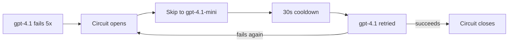

## What this snippet demonstrates

LLM API calls fail — rate limits, outages, timeouts. AFK's `fallback_model_chain` lets you define an ordered list of models to try when the primary model fails. This snippet shows how to configure fallback chains for resilience, cost optimization, and provider diversification.

## Basic fallback chain

```python
from afk.agents import Agent, FailSafeConfig

agent = Agent(
    name="resilient-agent",
    model="gpt-4.1",                    # Primary model
    instructions="Be helpful and thorough.",
    fail_safe=FailSafeConfig(
        # Fallback chain: try these models in order if the primary fails
        fallback_model_chain=[
            "gpt-4.1-mini",              # First fallback: cheaper, faster
            "gpt-4.1-nano",              # Last resort: fastest, cheapest
        ],

        # When LLM calls fail, retry then degrade
        llm_failure_policy="retry_then_degrade",

        # Cost ceiling still applies across all models
        max_total_cost_usd=1.00,
    ),
)
```

When `gpt-4.1` fails (timeout, rate limit, outage):

1. AFK retries with the primary model (controlled by retry policy)
2. If retries exhaust, it falls through to `gpt-4.1-mini`
3. If that also fails, it tries `gpt-4.1-nano`
4. If all models fail, the `llm_failure_policy` determines the outcome

## Cost-optimized fallback

Use expensive models only when needed:

```python
from afk.agents import Agent, FailSafeConfig
from afk.core import Runner

# Start cheap, escalate if quality is insufficient
simple_agent = Agent(
    name="classifier",
    model="gpt-4.1-nano",              # Start with cheapest
    instructions="""
    Classify the support ticket. Output exactly one label:
    billing, technical, account, other.
    """,
    fail_safe=FailSafeConfig(
        fallback_model_chain=["gpt-4.1-mini", "gpt-4.1"],
        max_total_cost_usd=0.05,
    ),
)

# Complex tasks get the big model with fallbacks
analysis_agent = Agent(
    name="analyst",
    model="gpt-4.1",                   # Start with most capable
    instructions="""
    Provide detailed technical analysis with code examples.
    Be thorough and precise.
    """,
    fail_safe=FailSafeConfig(
        fallback_model_chain=["gpt-4.1-mini"],
        llm_failure_policy="retry_then_degrade",
        max_total_cost_usd=2.00,
    ),
)

runner = Runner()

# Simple task → cheap model handles it
r1 = runner.run_sync(simple_agent, user_message="I can't log in")
print(f"Classification: {r1.final_text} (${r1.usage.estimated_cost_usd:.4f})")

# Complex task → powerful model with safety net
r2 = runner.run_sync(analysis_agent, user_message="Analyze Python's asyncio event loop")
print(f"Analysis: {r2.final_text[:100]}... (${r2.usage.estimated_cost_usd:.4f})")
```

## Circuit breaker integration

AFK's built-in circuit breaker works with fallback chains. When a model triggers too many failures, the breaker opens and the system skips straight to the next fallback:

```python
agent = Agent(
    name="breaker-demo",
    model="gpt-4.1",
    instructions="...",
    fail_safe=FailSafeConfig(
        fallback_model_chain=["gpt-4.1-mini", "gpt-4.1-nano"],

        # Circuit breaker settings
        breaker_failure_threshold=5,     # Open after 5 consecutive failures
        breaker_cooldown_s=30.0,         # Wait 30s before retrying the model

        # Failure handling
        llm_failure_policy="retry_then_degrade",
        max_total_cost_usd=1.00,
    ),
)
```



## Multi-agent with different model tiers

Use different model tiers for different specialists:

```python
from afk.agents import Agent, FailSafeConfig

# Cheap model for simple classification
router = Agent(
    name="router",
    model="gpt-4.1-nano",
    instructions="Route to the correct specialist.",
    fail_safe=FailSafeConfig(fallback_model_chain=["gpt-4.1-mini"]),
    subagents=[
        # Powerful model for complex analysis
        Agent(
            name="analyst",
            model="gpt-4.1",
            instructions="Provide deep technical analysis.",
            fail_safe=FailSafeConfig(
                fallback_model_chain=["gpt-4.1-mini"],
                max_total_cost_usd=1.00,
            ),
        ),
        # Mid-tier model for summarization
        Agent(
            name="summarizer",
            model="gpt-4.1-mini",
            instructions="Summarize findings concisely.",
            fail_safe=FailSafeConfig(
                fallback_model_chain=["gpt-4.1-nano"],
                max_total_cost_usd=0.25,
            ),
        ),
    ],
)
```

## Inspecting which model was used

After a run, check the usage to see which model handled the request:

```python
result = runner.run_sync(agent, user_message="Analyze this...")

# Usage aggregate includes model info
print(f"State: {result.state}")
print(f"Total cost: ${result.usage.estimated_cost_usd:.4f}")
print(f"LLM calls: {result.usage.llm_call_count}")
```

## Recommendations

| Scenario                 | Primary Model  | Fallback Chain                  |
| ------------------------ | -------------- | ------------------------------- |
| **Classification**       | `gpt-4.1-nano` | `gpt-4.1-mini`                  |
| **General chat**         | `gpt-4.1-mini` | `gpt-4.1-nano`                  |
| **Complex analysis**     | `gpt-4.1`      | `gpt-4.1-mini` → `gpt-4.1-nano` |
| **Code generation**      | `gpt-4.1`      | `gpt-4.1-mini`                  |
| **Cost-sensitive batch** | `gpt-4.1-nano` | _(none)_                        |

## What to read next

- [Configuration Reference](/library/configuration-reference#failsafeconfig) — Full FailSafeConfig fields including circuit breaker settings.
- [Failure Policy Matrix](/library/failure-policy-matrix) — How failures flow through the system.
- [Snippet 11: Cost Monitoring](/library/snippets/11_cost_monitoring) — Track and control costs in real time.
