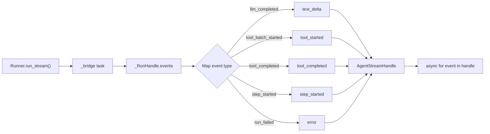

Stream agent execution events in real time — text deltas, tool lifecycle events, and status updates — via `Runner.run_stream()`.

## TL;DR

- `Runner.run_stream()` returns an `AgentStreamHandle` you async-iterate.
- Events include `text_delta`, `tool_started`, `tool_completed`, `step_started`, `completed`, and `error`.
- LLM-level streaming (`LLMStreamHandle`) already exists — this is the **agent-level** layer on top.
- `handle.result` gives the terminal `AgentResult` after the stream ends.
- `handle.collect_text()` collects all text deltas into a single string.

## When to Use

- You want to show LLM output to the user as it arrives.
- You need real-time visibility into tool execution during a run.
- You are building a chat UI with progressive rendering.

## Architecture



## Event Types

| Type             | Fields                                                   | Description                                   |
| ---------------- | -------------------------------------------------------- | --------------------------------------------- |
| `text_delta`     | `text_delta`                                             | Incremental text chunk from LLM               |
| `tool_started`   | `tool_name`, `tool_call_id`                              | Tool execution began                          |
| `tool_completed` | `tool_name`, `tool_success`, `tool_output`, `tool_error` | Tool finished                                 |
| `step_started`   | `step`, `state`                                          | New execution step began                      |
| `step_completed` | `step`, `state`                                          | Execution step finished                       |
| `status_update`  | `state`, `data`                                          | Agent state change                            |
| `completed`      | `result`                                                 | Run finished — carries terminal `AgentResult` |
| `error`          | `error`                                                  | Run error                                     |

## Quick Start

```python
from afk.core import Runner
from afk.agents import Agent

agent = Agent(name="assistant", model="openai/gpt-4o")
runner = Runner()

handle = await runner.run_stream(agent, user_message="Tell me a joke")
async for event in handle:
    if event.type == "text_delta":
        print(event.text_delta, end="", flush=True)
    elif event.type == "tool_started":
        print(f"\n🔧 calling {event.tool_name}...")
    elif event.type == "error":
        print(f"\n❌ {event.error}")

print(f"\n\nFinal state: {handle.result.state}")
```

## Collecting Full Text

If you just want the complete text output:

```python
handle = await runner.run_stream(agent, user_message="Summarize this")
full_text = await handle.collect_text()
print(full_text)
```

## Stream Layers

AFK has two streaming layers:

| Layer           | Module               | Granularity                             | Use Case                     |
| --------------- | -------------------- | --------------------------------------- | ---------------------------- |
| **LLM-level**   | `afk.llms.types`     | Token-by-token within a single LLM call | LLM adapter implementations  |
| **Agent-level** | `afk.core.streaming` | Event-per-step across entire agent run  | Application-facing streaming |

The agent-level stream bridges `AgentRunEvent` instances from the existing `_RunHandle.events` queue into typed `AgentStreamEvent` objects.

## Continue Reading

1. [Architecture](/library/architecture)
2. [Run Event Contract](/library/run-event-contract)
3. [LLM Interaction](/library/llm-interaction)
