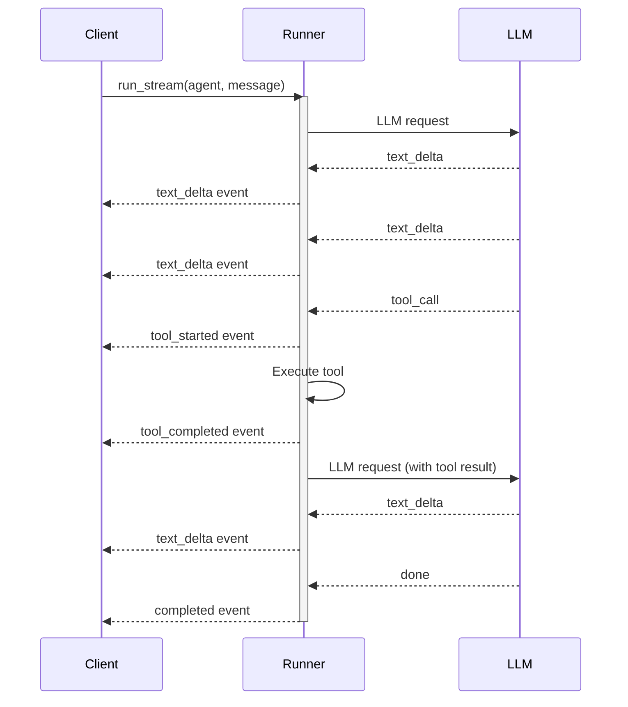

AFK supports real-time streaming via `Runner.run_stream()`. Instead of waiting for the full response, you receive events as they happen — incremental text, tool lifecycle updates, and status changes.

## Quick example

```python
import asyncio
from afk.agents import Agent
from afk.core import Runner

agent = Agent(name="explainer", model="gpt-4.1-mini", instructions="Explain clearly.")

async def main():
    runner = Runner()
    handle = await runner.run_stream(agent, user_message="Explain DNS resolution")

    async for event in handle:
        match event.type:
            case "text_delta":
                print(event.text_delta, end="", flush=True)
            case "completed":
                print(f"\n✓ Done ({event.result.state})")

asyncio.run(main())
```

## Stream lifecycle



## Event reference

| Event type           | When it fires                 | Key fields                                             |
| -------------------- | ----------------------------- | ------------------------------------------------------ |
| `text_delta`         | Incremental text from the LLM | `event.text_delta`                                     |
| `step_started`       | New step in the agent loop    | `event.step_index`                                     |
| `step_completed`     | Step finished                 | `event.step_index`                                     |
| `tool_started`       | A tool is about to execute    | `event.tool_name`, `event.tool_args`                   |
| `tool_completed`     | A tool finished               | `event.tool_name`, `event.success`, `event.latency_ms` |
| `subagent_started`   | Subagent delegation begins    | `event.subagent_name`                                  |
| `subagent_completed` | Subagent returned             | `event.subagent_name`, `event.success`                 |
| `error`              | Non-fatal error               | `event.error`, `event.recoverable`                     |
| `completed`          | Run finished                  | `event.result` (full `AgentResult`)                    |
| `cancelled`          | Run was cancelled             | —                                                      |

## Stream control

```python
handle = await runner.run_stream(agent, user_message="Long analysis...")

# Pause the stream (buffers events)
await handle.pause()

# Resume the stream (replays buffered events)
await handle.resume()

# Cancel the entire run
await handle.cancel()

# Access the final result after streaming finishes
result = handle.result
```

## When to stream vs await

<Tabs>
  <Tab title="Use streaming when">
    - Building a **chat UI** that shows text as it arrives - Running a **CLI
    tool** with live output - Monitoring **tool calls** in real time - Building
    a **progress indicator** for long-running agents - Need to **cancel**
    mid-run based on user action
  </Tab>
  <Tab title="Use sync/async when">
    - Running in a **batch pipeline** (process results after completion) -
    Writing **tests** (assert on final result only) - **API server** that
    returns a single response - **Simple scripts** where you just need the
    answer
  </Tab>
</Tabs>

## Full pattern: chat UI handler

```python
import asyncio
from afk.agents import Agent
from afk.core import Runner

agent = Agent(
    name="assistant",
    model="gpt-4.1-mini",
    instructions="Be helpful and concise.",
    tools=[search, calculate],  # hypothetical tools
)

async def handle_chat(user_message: str):
    """Stream an agent response, yielding events for the UI."""
    runner = Runner()
    handle = await runner.run_stream(agent, user_message=user_message)

    async for event in handle:
        match event.type:
            case "text_delta":
                yield {"type": "text", "content": event.text_delta}
            case "tool_started":
                yield {"type": "tool", "status": "running", "name": event.tool_name}
            case "tool_completed":
                status = "success" if event.success else "error"
                yield {"type": "tool", "status": status, "name": event.tool_name}
            case "error":
                yield {"type": "error", "message": str(event.error)}
            case "completed":
                yield {"type": "done", "state": event.result.state}
```

## Error handling in streams

Errors during streaming are delivered as events — they don't crash the stream iterator:

```python
async for event in handle:
    match event.type:
        case "error":
            if event.recoverable:
                print(f"⚠️ Recoverable: {event.error}")
                # Stream continues — the runner will retry or degrade
            else:
                print(f"❌ Fatal: {event.error}")
                # Next event will be 'completed' with state='failed'
        case "completed":
            if event.result.state == "failed":
                print(f"Run failed: {event.result.final_text}")
```

<Tip>
  **Recoverable errors** (tool failures with `continue` policy, rate limit
  retries) don't stop the stream. The runner handles recovery automatically and
  keeps streaming. You get an `error` event for observability, but the final
  `completed` event may still arrive with `state="completed"`.
</Tip>

## Next steps

<CardGroup cols={2}>
  <Card title="Memory" icon="database" href="/library/memory">
    Persist state across streaming runs.
  </Card>
  <Card title="Core Runner" icon="play" href="/library/core-runner">
    Full lifecycle and API reference.
  </Card>
</CardGroup>
