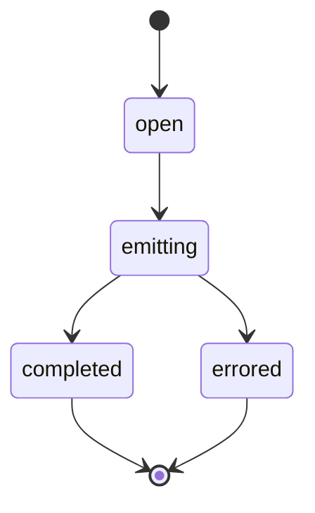

## Stream lifecycle



## Example consumer

```python
handle = await runner.run_stream(agent, user_message="Give rollout checklist")
async for event in handle:
    if event.type == "text_delta":
        print(event.text_delta, end="")
```
