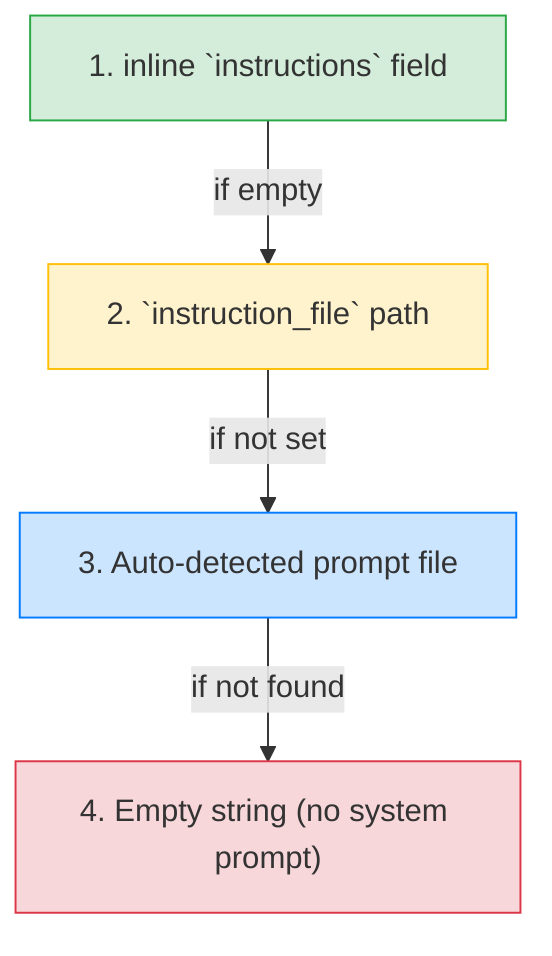

System prompts define what your agent knows and how it behaves. AFK supports three methods — inline strings, instruction files, and auto-detection — with Jinja2 templating for dynamic values.

## Three ways to set instructions

<Tabs>
  <Tab title="Inline string">
    Set instructions directly on the Agent. Best for simple, static prompts.

    ```python
    agent = Agent(
        name="assistant",
        model="gpt-4.1-mini",
        instructions="You are a helpful assistant. Be concise and accurate.",
    )
    ```

  </Tab>
  <Tab title="Instruction file">
    Store the prompt in a separate file. Best for long or version-controlled prompts.

    ```python
    agent = Agent(
        name="analyst",
        model="gpt-4.1-mini",
        instruction_file="prompts/analyst.md",
    )
    ```

    ```markdown prompts/analyst.md
    You are a financial analyst specializing in tech companies.

    ## Guidelines
    - Use data-driven analysis
    - Cite specific metrics when available
    - Present both bull and bear cases
    - Keep responses under 500 words
    ```

  </Tab>
  <Tab title="Auto-detection">
    AFK automatically looks for an instruction file based on the agent's name:

    ```python
    agent = Agent(name="writer", model="gpt-4.1-mini")
    # AFK looks for: prompts/writer.md, prompts/writer.txt, writer.md, etc.
    ```

    The resolution order:
    1. `prompts/{agent_name}.md`
    2. `prompts/{agent_name}.txt`
    3. `{agent_name}.md`
    4. `{agent_name}.txt`

  </Tab>
</Tabs>

## Precedence chain

When multiple sources are available, AFK uses this order:



The first non-empty source wins. If you set both `instructions` and `instruction_file`, the inline string takes priority.

## Template variables with Jinja2

Use `{{ variable }}` syntax to inject dynamic values into prompts:

```python
agent = Agent(
    name="support-agent",
    model="gpt-4.1-mini",
    instructions="""
    You are a support agent for {{ company_name }}.
    Today's date is {{ current_date }}.
    The customer's plan is {{ plan_tier }}.

    
    You may offer extended SLAs and priority escalation.
    
    Refer complex issues to the support team.
    
    """,
    context={
        "company_name": "Acme Corp",
        "current_date": "2025-01-15",
        "plan_tier": "enterprise",
    },
)
```

### Available template variables

| Source               | Variables                            | Example                                 |
| -------------------- | ------------------------------------ | --------------------------------------- |
| `Agent.context` dict | Any key-value pairs you set          | `{{ company_name }}`, `{{ user_role }}` |
| Built-in             | `agent_name`, `model_name`           | `{{ agent_name }}`                      |
| Runtime              | `run_id`, `thread_id` (if available) | `{{ thread_id }}`                       |

## Prompt from file with templates

Templates work in instruction files too:

```python
agent = Agent(
    name="reviewer",
    model="gpt-4.1-mini",
    instruction_file="prompts/reviewer.md",
    context={
        "language": "Python",
        "style_guide": "PEP 8",
        "max_issues": 10,
    },
)
```

```markdown prompts/reviewer.md
You are a {{ language }} code reviewer following {{ style_guide }}.

## Rules

- Report at most {{ max_issues }} issues per review
- Classify issues as: error, warning, style
- Suggest a fix for each issue
- Be constructive and specific
```

## Error handling

| Error                   | Cause                                 | Resolution                                                                                   |
| ----------------------- | ------------------------------------- | -------------------------------------------------------------------------------------------- |
| `PromptResolutionError` | `instruction_file` path doesn't exist | Check the file path. Make sure it's relative to the working directory or absolute.           |
| `PromptTemplateError`   | Jinja2 template syntax error          | Check for unclosed `{{ }}` or `` blocks.                                                |
| `PromptTemplateError`   | Missing template variable             | Add the variable to `Agent.context` or provide a default: `{{ var \| default("fallback") }}` |

<Tip>
  **Keep prompts in version control.** Store instruction files in a `prompts/`
  directory and track changes in git. This gives you prompt history, diffs, and
  the ability to A/B test prompt versions.
</Tip>

## Design guidelines

- **Inline for prototyping,** files for production. Switch to instruction files when your prompt exceeds ~5 lines.
- **Use templates for anything dynamic.** Don't concatenate strings — use `{{ variable }}` and set values in `context`.
- **Be specific in instructions.** Tell the agent what to do _and_ what not to do. Include output format expectations.
- **Test prompt changes with evals.** A small prompt change can dramatically shift behavior. Run your eval suite after any edit.

## Next steps

<CardGroup cols={2}>
  <Card title="Agent Skills" icon="book-open" href="/library/agent-skills">
    Reusable knowledge bundles loaded on demand.
  </Card>
  <Card title="Evals" icon="check-circle" href="/library/evals">
    Test prompt changes with behavioral assertions.
  </Card>
</CardGroup>
