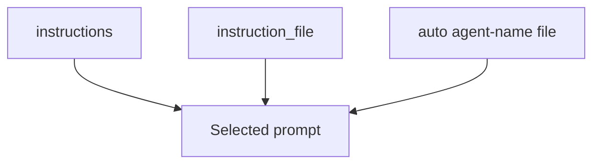

## Resolution precedence

```mermaid
flowchart TB
    Inline[instructions] --> Selected[Selected prompt]
    File[instruction_file] --> Selected
    Auto[auto agent-name file] --> Selected
```

## Prompt root order

1. `prompts_dir`
2. `AFK_AGENT_PROMPTS_DIR`
3. `.agents/prompt`
