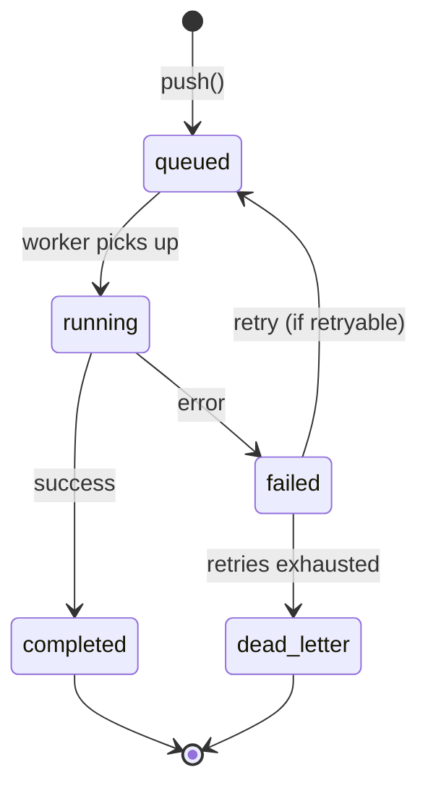

Task queues decouple agent work producers from consumers. Push a task, a worker picks it up, and the result is stored — independently of the caller's lifecycle. Use queues for long-running jobs, batch processing, and reliable retries.

## Quick start

```python
from afk.queues import TaskQueue, TaskItem
from afk.agents import Agent
from afk.core import Runner

agent = Agent(name="analyzer", model="gpt-4.1-mini", instructions="Analyze data.")

# Push a task
queue = TaskQueue()
await queue.push(TaskItem(
    contract="runner.chat.v1",
    agent=agent,
    user_message="Analyze Q4 revenue trends",
))

# A worker picks it up automatically
```

## Task lifecycle



| State         | Meaning                                     |
| ------------- | ------------------------------------------- |
| `queued`      | Waiting to be picked up by a worker         |
| `running`     | A worker is executing the task              |
| `completed`   | Task finished successfully                  |
| `failed`      | Task hit an error (may be retried)          |
| `dead_letter` | All retries exhausted — needs manual review |

## Execution contracts

Every task has a **contract** that defines what kind of work it represents:

<Tabs>
  <Tab title="runner.chat.v1">
    Standard agent chat. Runs an agent with a user message.

    ```python
    task = TaskItem(
        contract="runner.chat.v1",
        agent=agent,
        user_message="Analyze this data",
        thread_id="t-42",              # Optional: for multi-turn
        timeout_s=120.0,               # Max execution time
    )
    ```

  </Tab>
  <Tab title="job.dispatch.v1">
    Generic job dispatch. Runs a custom handler function.

    ```python
    task = TaskItem(
        contract="job.dispatch.v1",
        handler="myapp.jobs.process_report",
        payload={"report_id": "R-123", "format": "pdf"},
        timeout_s=300.0,
    )
    ```

  </Tab>
  <Tab title="Custom contract">
    Define your own contract for specialized workloads:

    ```python
    task = TaskItem(
        contract="myapp.batch.v1",
        payload={
            "batch_id": "B-456",
            "items": ["item1", "item2", "item3"],
            "max_concurrency": 5,
        },
    )
    ```

    Register a handler for the contract on the worker side.

  </Tab>
</Tabs>

## Worker setup

<Steps>
  <Step title="Create a worker">
    ```python
    from afk.queues import Worker

    worker = Worker(
        queue=queue,
        runner_factory=lambda: Runner(),
        max_concurrency=5,            # Process up to 5 tasks in parallel
    )
    ```

  </Step>
  <Step title="Register custom contract handlers">
    ```python
    @worker.handler("myapp.batch.v1")
    async def handle_batch(task: TaskItem) -> dict:
        # Custom processing logic
        results = await process_batch(task.payload["items"])
        return {"processed": len(results)}
    ```
  </Step>
  <Step title="Start the worker">
    ```python
    await worker.start()  # Runs until stopped
    ```
  </Step>
</Steps>

## Dead-letter handling

When a task exhausts all retries, it moves to the dead-letter queue (DLQ):

```python
# Check for dead letters
dead_letters = await queue.get_dead_letters()

for task in dead_letters:
    print(f"Failed: {task.contract} — {task.error}")

    # Retry manually after fixing the issue
    await queue.retry_dead_letter(task.task_id)

    # Or discard it
    await queue.discard_dead_letter(task.task_id)
```

## Error classification

The queue uses error classification to decide whether to retry:

| Error type    | Retried?                         | Example                                          |
| ------------- | -------------------------------- | ------------------------------------------------ |
| **Retryable** | ✅ (with backoff)                | Network timeout, rate limit, transient LLM error |
| **Terminal**  | ❌ (sent to DLQ)                 | Invalid arguments, auth failure, missing model   |
| **Non-fatal** | ❌ (task completes with warning) | Telemetry export failure                         |

## Queue backends

<Tabs>
  <Tab title="In-memory (default)">
    State lives in process memory. No setup required.

    ```python
    queue = TaskQueue()  # In-memory by default
    ```

    **Use for:** Development, testing, prototyping.

  </Tab>
  <Tab title="Redis">
    Durable queue with persistence and multi-worker support.

    ```python
    queue = TaskQueue(
        backend="redis",
        redis_url="redis://localhost:6379/0",
    )
    ```

    Set via environment variables:
    ```bash
    export AFK_QUEUE_BACKEND=redis
    export AFK_QUEUE_REDIS_URL=redis://localhost:6379/0
    ```

    **Use for:** Production deployments, multi-process workers.

  </Tab>
</Tabs>

## Next steps

<CardGroup cols={2}>
  <Card title="MCP Server" icon="plug" href="/library/mcp-server">
    Expose tools via the Model Context Protocol.
  </Card>
  <Card title="Observability" icon="chart-bar" href="/library/observability">
    Monitor queue performance and worker health.
  </Card>
</CardGroup>
