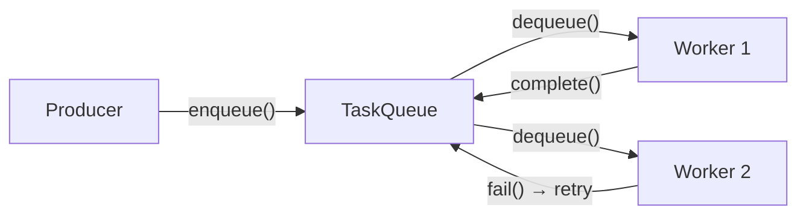
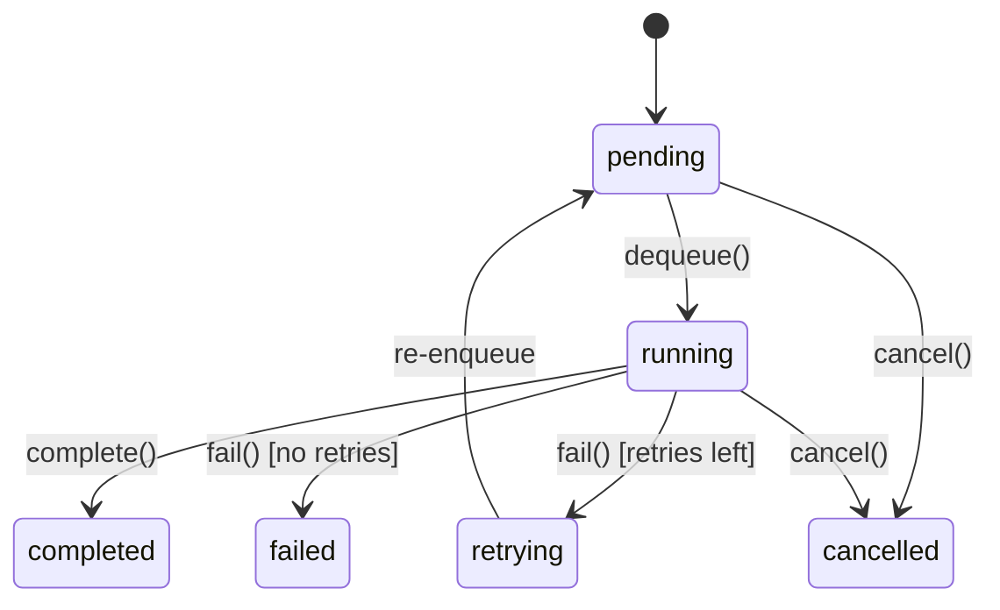

Distribute agent work across workers using durable task queues. Tasks are enqueued with agent name and payload, then consumed and executed by `TaskWorker` instances.

## TL;DR

- `TaskQueue` is the queue abstraction — enqueue, dequeue, complete, fail, cancel, list.
- `TaskItem` tracks lifecycle: `pending → running → completed/failed/cancelled`.
- Automatic retry: if `retry_count < max_retries`, failed tasks are re-enqueued.
- `TaskWorker` is a concurrent consumer loop with configurable parallelism.
- Two backends: `InMemoryTaskQueue` and `RedisTaskQueue`.

## When to Use

- You need to distribute agent execution across multiple workers.
- Tasks should survive process restarts (use Redis backend).
- You want automatic retry for transient failures.
- You need to track task status and results.

## Architecture



## Task Lifecycle



## Quick Start

### Enqueuing Tasks

```python
from afk.queues import InMemoryTaskQueue

queue = InMemoryTaskQueue()

# Simple enqueue
task = await queue.enqueue_simple(
    "summarizer",
    "Summarize the latest news about AI",
    max_retries=3,
)
print(f"Task {task.id} enqueued")
```

### Running a Worker

```python
from afk.queues import TaskWorker, TaskWorkerConfig
from afk.agents import Agent

summarizer = Agent(name="summarizer", model="openai/gpt-4o")

worker = TaskWorker(
    queue,
    agents={"summarizer": summarizer},
    config=TaskWorkerConfig(
        max_concurrent_tasks=4,
        poll_interval_s=1.0,
    ),
)

await worker.start()
# Worker runs until shutdown
await worker.shutdown()
```

## TaskItem Fields

| Field          | Type                | Description                                  |
| -------------- | ------------------- | -------------------------------------------- |
| `id`           | `str`               | Unique task ID (auto-generated)              |
| `agent_name`   | `str`               | Agent to execute this task                   |
| `payload`      | `dict`              | Task input (`user_message`, `context`, etc.) |
| `status`       | `TaskStatus`        | Current lifecycle state                      |
| `result`       | `JSONValue \| None` | Output after completion                      |
| `error`        | `str \| None`       | Error message on failure                     |
| `retry_count`  | `int`               | Times retried so far                         |
| `max_retries`  | `int`               | Max allowed retries (default: 3)             |
| `created_at`   | `float`             | Enqueue timestamp                            |
| `started_at`   | `float \| None`     | Execution start timestamp                    |
| `completed_at` | `float \| None`     | Terminal state timestamp                     |

## Worker Configuration

| Option                 | Default | Description                                  |
| ---------------------- | ------- | -------------------------------------------- |
| `poll_interval_s`      | `1.0`   | Seconds between dequeue attempts when idle   |
| `max_concurrent_tasks` | `4`     | Maximum tasks executed in parallel           |
| `shutdown_timeout_s`   | `30.0`  | Grace period for in-flight tasks on shutdown |

## Worker Callbacks

```python
async def on_complete(task):
    print(f"✅ Task {task.id} completed")

async def on_failure(task):
    print(f"❌ Task {task.id} failed: {task.error}")

worker = TaskWorker(
    queue,
    agents=agents,
    on_complete=on_complete,
    on_failure=on_failure,
)
```

## Backends

### InMemoryTaskQueue

- Uses `asyncio.Queue` + dict for tracking
- Suitable for single-process systems and testing
- Tasks are lost on process exit

### RedisTaskQueue

- Uses Redis list for FIFO ordering + hash for state tracking
- Tasks persist across restarts
- Uses `BLPOP` for efficient blocking dequeue
- Requires `pip install redis`

```python
import redis.asyncio as redis
from afk.queues import RedisTaskQueue

r = redis.Redis(host="localhost", port=6379)
queue = RedisTaskQueue(r)

await queue.enqueue_simple("analyzer", "Analyze sales data")
```

## Continue Reading

1. [Agent-to-Agent Messaging](/library/messaging)
2. [Observability](/library/observability)
3. [Architecture](/library/architecture)
