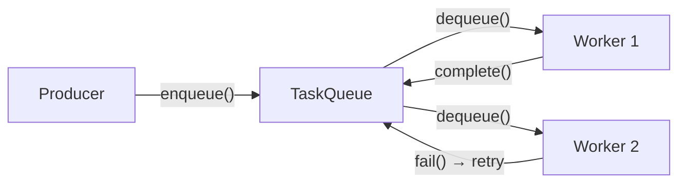
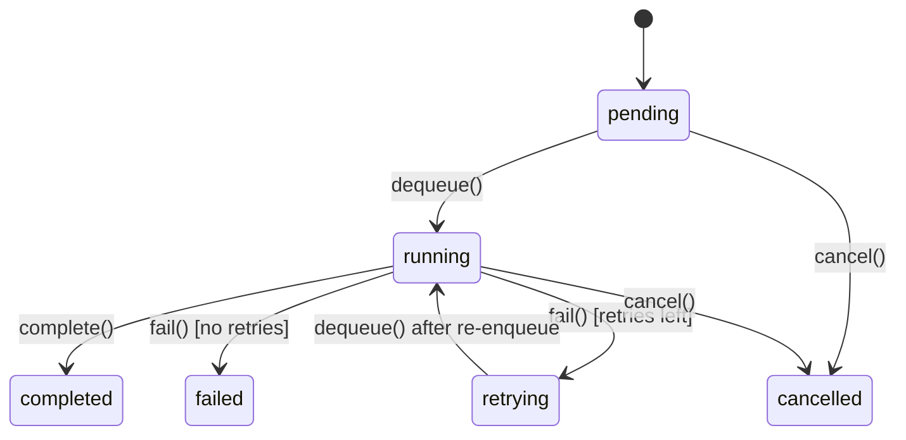

Distribute agent and non-agent work across workers using durable task queues. Tasks are enqueued with a contract id and payload, then consumed and executed by `TaskWorker` instances.

## TL;DR

- `TaskQueue` is the queue abstraction — enqueue, dequeue, complete, fail, cancel, list.
- `BaseTaskQueue` provides shared lifecycle behavior so new backends only implement storage primitives.
- `TaskItem` tracks lifecycle: `pending → running → retrying/completed/failed/cancelled`.
- Automatic retry: tasks are re-enqueued while `retry_count <= max_retries`.
- `TaskWorker` is a concurrent consumer loop with contract-aware dispatch.
- Built-in contracts: `runner.chat.v1` and `job.dispatch.v1`.
- Successful results are normalized to `{ "contract": "<id>", "output": ... }`.
- Retryable failures can be deferred with backoff (`metadata.next_attempt_at`).
- Terminal failures include DLQ reason metadata (`metadata.dead_letter_reason`).
- Two backends: `InMemoryTaskQueue` and `RedisTaskQueue`.

## When to Use

- You need to distribute agent execution across multiple workers.
- Tasks should survive process restarts (use Redis backend).
- You want automatic retry for transient failures.
- You need to track task status and results.

## Architecture



## Task Lifecycle



## Reliability Controls

- Retry backoff: queue retries may be deferred using `metadata["next_attempt_at"]`.
- Dead-letter reason: terminal failures set `metadata["dead_letter_reason"]` to:
  - `non_retryable_error`
  - `retry_budget_exhausted`
- DLQ inspection: use `await queue.list_dead_letters(limit=...)`.
- DLQ operations:
  - `await queue.redrive_dead_letters(limit=..., reason=...)`
  - `await queue.purge_dead_letters(limit=..., reason=...)`

## Quick Start

### Enqueuing Tasks

```python
from afk.queues import InMemoryTaskQueue, RUNNER_CHAT_CONTRACT

queue = InMemoryTaskQueue()

# Explicit contract enqueue
task = await queue.enqueue_contract(
    RUNNER_CHAT_CONTRACT,
    payload={
        "user_message": "Summarize the latest news about AI",
        "context": {},
    },
    agent_name="summarizer",
    max_retries=3,
)
print(f"Task {task.id} enqueued")
```

```python
from afk.queues import JOB_DISPATCH_CONTRACT

# Explicit contract enqueue (recommended)
task = await queue.enqueue_contract(
    JOB_DISPATCH_CONTRACT,
    payload={
        "job_type": "reindex",
        "arguments": {"tenant_id": "t_123"},
    },
    agent_name=None,
)
```

### Running a Worker

```python
from afk.queues import TaskWorker, TaskWorkerConfig
from afk.agents import Agent

summarizer = Agent(name="summarizer", model="openai/gpt-4o")

worker = TaskWorker(
    queue,
    agents={"summarizer": summarizer},
    config=TaskWorkerConfig(
        max_concurrent_tasks=4,
        poll_interval_s=1.0,
    ),
)

await worker.start()
# Worker runs in background until shutdown
await worker.shutdown()
```

For backends that support worker presence (for example `RedisTaskQueue`),
`TaskWorker.start()` automatically attempts startup in-flight recovery only
when this worker is the sole active worker.
Set `worker_presence_refresh_s` lower than `worker_presence_ttl_s`.

### Backend From Environment

```python
from afk.queues import create_task_queue_from_env

queue = create_task_queue_from_env()
```

`create_task_queue_from_env()` reads `AFK_QUEUE_BACKEND` and creates either
`InMemoryTaskQueue` or `RedisTaskQueue`.

## Execution Contracts

Contracts are resolved from `task.metadata["execution_contract"]`.

- If missing, worker fails the task immediately without retry.
- Unknown/invalid contracts fail task immediately without retry.
- Contract registration is worker-scoped via `TaskWorker(..., execution_contracts=...)`.

### Built-in Contracts

1. `runner.chat.v1`
- Requires `agent_name`.
- Payload shape:
```json
{
  "user_message": "string | null",
  "context": {}
}
```

2. `job.dispatch.v1`
- Does not require `agent_name`.
- Payload shape:
```json
{
  "job_type": "string",
  "arguments": {}
}
```
- Dispatches to `TaskWorker(..., job_handlers={"job_type": handler})`.

### Result Envelope

All successful task completions store results as:

```json
{
  "contract": "runner.chat.v1",
  "output": {}
}
```

## TaskItem Fields

| Field          | Type                | Description                                  |
| -------------- | ------------------- | -------------------------------------------- |
| `id`           | `str`               | Unique task ID (auto-generated)              |
| `agent_name`   | `str \| None`       | Agent identifier (optional for non-agent contracts) |
| `payload`      | `dict`              | Contract-specific task input                 |
| `status`       | `TaskStatus`        | Current lifecycle state                      |
| `result`       | `JSONValue \| None` | Contract envelope `{contract, output}`       |
| `error`        | `str \| None`       | Error message on failure                     |
| `retry_count`  | `int`               | Times retried so far                         |
| `max_retries`  | `int`               | Max allowed retries (default: 3)             |
| `created_at`   | `float`             | Enqueue timestamp                            |
| `started_at`   | `float \| None`     | Execution start timestamp                    |
| `completed_at` | `float \| None`     | Terminal state timestamp                     |

## Worker Configuration

| Option                 | Default | Description                                  |
| ---------------------- | ------- | -------------------------------------------- |
| `poll_interval_s`      | `1.0`   | Seconds between dequeue attempts when idle   |
| `max_concurrent_tasks` | `4`     | Maximum tasks executed in parallel           |
| `shutdown_timeout_s`   | `30.0`  | Grace period for in-flight tasks on shutdown |
| `recover_inflight_on_startup` | `true` | Requeue stale in-flight tasks when queue supports startup recovery and no other workers are active |
| `worker_presence_ttl_s` | `30.0` | Active-worker presence TTL for supported backends |
| `worker_presence_refresh_s` | `10.0` | Presence heartbeat interval for supported backends |

## Worker Callbacks

```python
async def on_complete(task):
    print(f"✅ Task {task.id} completed")

async def on_failure(task):
    print(f"❌ Task {task.id} failed: {task.error}")

worker = TaskWorker(
    queue,
    agents=agents,
    on_complete=on_complete,
    on_failure=on_failure,
)
```

## Worker Metrics

```python
from afk.queues import PrometheusWorkerMetrics, TaskWorker

metrics = PrometheusWorkerMetrics(namespace="afk")
worker = TaskWorker(queue, agents=agents, metrics=metrics)
```

Counters emitted:
- `queue_worker_dequeued_total`
- `queue_worker_completed_total`
- `queue_worker_failed_retryable_total`
- `queue_worker_failed_non_retryable_total`
- `queue_worker_recovered_inflight_total`

## Backends

### InMemoryTaskQueue

- Uses `asyncio.Queue` + dict for tracking
- Suitable for single-process systems and testing
- Tasks are lost on process exit

### RedisTaskQueue

- Uses Redis `pending` + `inflight` lists for crash-safe dequeue tracking, plus hash for task state
- Tasks persist across restarts
- Uses `BRPOPLPUSH` to atomically move dequeued IDs into in-flight tracking
- Worker startup can auto-recover stale in-flight IDs only when it is the sole active worker (presence + lock guarded)
- Requires `pip install redis`

```python
import redis.asyncio as redis
from afk.queues import RUNNER_CHAT_CONTRACT, RedisTaskQueue

r = redis.Redis(host="localhost", port=6379)
queue = RedisTaskQueue(r)

await queue.enqueue_contract(
    RUNNER_CHAT_CONTRACT,
    payload={"user_message": "Analyze sales data", "context": {}},
    agent_name="analyzer",
)

# Optional crash-recovery step on startup when no workers are running:
# moved = await queue.requeue_inflight()
# print(f"Requeued {moved} in-flight task ids")
```

## Continue Reading

1. [Agent-to-Agent Messaging](/library/messaging)
2. [Observability](/library/observability)
3. [Architecture](/library/architecture)

## Ops Runbook

1. Startup
- Start worker group and verify presence heartbeats.
- For Redis, startup recovery is lock-guarded and only runs when one active worker is detected.

2. Monitoring
- Track queue depth, retrying count, failed count, dead-letter count.
- Alert on sustained growth of non-retryable failures.
- Alert when dead-letter count breaches threshold.

3. Incident Response
- Inspect dead letters with `list_dead_letters`.
- Re-drive safe failures in batches with `redrive_dead_letters`.
- Purge unrecoverable failures after archival with `purge_dead_letters`.

4. Deploy/Restart
- Gracefully shut down workers before restart.
- Validate no unexpected spike in `queue_worker_recovered_inflight_total`.

## Load Testing

Use benchmark script:

```bash
PYTHONPATH=src python scripts/queue_benchmark.py --backend inmemory
PYTHONPATH=src python scripts/queue_benchmark.py --backend redis --redis-url redis://localhost:6379/0
```

Run real Redis integration tests in CI/staging:

```bash
export AFK_TEST_REDIS_URL=redis://localhost:6379/0
pytest -q tests/queues/test_redis_integration.py
```
