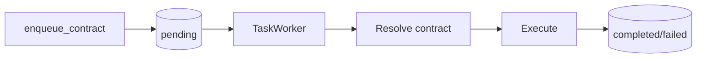

AFK's task queue system provides **queue-based asynchronous execution** for agent workloads and standalone jobs. Instead of invoking agents synchronously, you enqueue tasks with an **execution contract** that tells the worker how to process them. The worker dequeues tasks, resolves the contract, executes the work, and manages the full lifecycle including retries, failure classification, and dead-letter handling.

This architecture decouples task producers from consumers, letting you scale workers independently, implement backpressure, and recover gracefully from failures. Two built-in execution contracts cover the most common patterns: `runner.chat.v1` for agent-backed conversational work and `job.dispatch.v1` for non-agent job execution. You can also define custom contracts for specialized workloads.

## Queue Flow

The following diagram shows the lifecycle of a task from enqueue to terminal state:



**Step-by-step walkthrough:**

1. **Enqueue** -- A producer calls `queue.enqueue_contract()` with an execution contract ID, payload, and optional agent name. The queue creates a `TaskItem` with status `pending` and pushes it to the pending queue.
2. **Dequeue** -- The `TaskWorker` polls the queue via `dequeue()`. When a pending task is available, it transitions to `running` and is handed to the worker.
3. **Resolve contract** -- The worker looks up the execution contract by ID from its contract registry. If the contract is unknown or the task metadata is missing the contract key, the task fails immediately without retry.
4. **Execute** -- The resolved contract's `execute()` method runs the task. For `runner.chat.v1`, this spins up a `Runner` and calls `runner.run()` with the agent. For `job.dispatch.v1`, this looks up a registered job handler and calls it.
5. **Terminal state** -- On success, the task moves to `completed` with a result payload. On failure, the task either enters `retrying` (if retryable and retry budget remains) or `failed` (terminal).

## Execution Contracts

Execution contracts define how a task should be processed. Each contract has a `contract_id`, a `requires_agent` flag, and an `execute()` method. The worker resolves the contract from `task.metadata["execution_contract"]` and dispatches accordingly.

### runner.chat.v1

The `RunnerChatExecutionContract` is for agent-backed conversational work. It creates a `Runner`, passes it the resolved agent and the task payload, and returns the agent's response.

**Contract ID:** `runner.chat.v1`
**Requires agent:** Yes -- the task must have a valid `agent_name` that maps to a registered agent in the worker.

**Expected payload fields:**

| Field | Type | Required | Description |
|---|---|---|---|
| `user_message` | `str \| None` | No | The user message to send to the agent. When `None`, the agent runs with no new user input (useful for continuation). |
| `context` | `dict[str, JSONValue] \| None` | No | Optional context dictionary passed to `runner.run()`. |

**Return value:** `{"final_text": str, "state": str}` -- the agent's final text output and terminal state.

```python
from afk.queues import create_task_queue_from_env

queue = create_task_queue_from_env()

# Enqueue an agent-backed task
task = await queue.enqueue_contract(
    execution_contract="runner.chat.v1",
    payload={"user_message": "Summarize the quarterly report"},
    agent_name="summarizer",
    max_retries=3,
)

print(f"Task {task.id} enqueued with status: {task.status}")
```

### job.dispatch.v1

The `JobDispatchExecutionContract` is for non-agent work that does not require an LLM or a `Runner`. It looks up a named handler function from the worker's `job_handlers` registry and calls it with the task arguments.

**Contract ID:** `job.dispatch.v1`
**Requires agent:** No -- the `agent_name` field is ignored.

**Expected payload fields:**

| Field | Type | Required | Description |
|---|---|---|---|
| `job_type` | `str` | Yes | The name of the registered job handler to invoke. Must be non-empty and match a key in the worker's `job_handlers` map. |
| `arguments` | `dict[str, JSONValue]` | No | Arguments passed to the handler function. Defaults to an empty dict. |

**Handler signature:** The `JobHandler` protocol accepts `(arguments: dict, *, task_item: TaskItem) -> JSONValue`. Handlers can be synchronous or asynchronous -- the worker detects and awaits async handlers automatically.

```python
from afk.queues import create_task_queue_from_env

queue = create_task_queue_from_env()

# Enqueue a standalone job
task = await queue.enqueue_contract(
    execution_contract="job.dispatch.v1",
    payload={
        "job_type": "reindex",
        "arguments": {"tenant": "acme", "index": "products"},
    },
)

print(f"Job {task.id} enqueued")
```

The job handler is registered when creating the `TaskWorker`:

```python
from afk.queues.worker import TaskWorker
from afk.queues.types import TaskItem
from afk.llms.types import JSONValue

async def handle_reindex(arguments: dict[str, JSONValue], *, task_item: TaskItem) -> JSONValue:
    tenant = arguments["tenant"]
    index = arguments["index"]
    # ... perform reindexing logic ...
    return {"reindexed": True, "tenant": tenant, "index": index}

worker = TaskWorker(
    queue,
    agents={"summarizer": summarizer_agent},
    job_handlers={"reindex": handle_reindex},
)
```

## TaskItem Reference

The `TaskItem` is a mutable dataclass representing a unit of work in the queue. The queue and worker manage its lifecycle fields as the task progresses through states.

| Field | Type | Default | Description |
|---|---|---|---|
| `id` | `str` | Auto-generated UUID | Unique task identifier. Generated at creation time via `uuid.uuid4().hex`. |
| `agent_name` | `str \| None` | -- | Agent to execute this task. Required by contracts that set `requires_agent=True`, ignored otherwise. |
| `payload` | `dict[str, JSONValue]` | -- | Contract-specific input data. The structure depends on which execution contract processes the task. |
| `status` | `TaskStatus` | `"pending"` | Current lifecycle state. One of: `pending`, `running`, `completed`, `failed`, `retrying`, `cancelled`. |
| `result` | `JSONValue \| None` | `None` | Output payload after successful completion. Set by `queue.complete()`. |
| `error` | `str \| None` | `None` | Error message on failure. Set by `queue.fail()`. |
| `retry_count` | `int` | `0` | Number of times this task has been retried after failure. Incremented on each call to `queue.fail()`. |
| `max_retries` | `int` | `3` | Maximum allowed retries before the task is permanently failed. When `retry_count > max_retries`, the task transitions to terminal `failed`. |
| `created_at` | `float` | `time.time()` | Unix timestamp when the task was created. |
| `started_at` | `float \| None` | `None` | Unix timestamp when execution began (status transitioned to `running`). Reset on each retry. |
| `completed_at` | `float \| None` | `None` | Unix timestamp when the task reached a terminal state (`completed`, `failed`, or `cancelled`). |
| `metadata` | `dict[str, JSONValue]` | `{}` | Arbitrary JSON-safe metadata. The queue system uses reserved keys like `execution_contract`, `next_attempt_at`, `dead_letter_reason`, and retry backoff parameters. |

**Computed properties:**

- `is_terminal` -- Returns `True` when `status` is `completed`, `failed`, or `cancelled`. Terminal tasks are immutable.
- `duration_s` -- Returns the execution duration in seconds (from `started_at` to `completed_at`), or `None` if unavailable.
- `execution_contract` -- Reads the contract ID from `metadata["execution_contract"]`.

**Task status lifecycle:**

```
pending ──> running ──> completed
   │           │
   │           ├──> retrying ──> pending (re-enqueued)
   │           │
   │           └──> failed (terminal)
   │
   └──> cancelled (terminal)
```

## Worker Lifecycle

The `TaskWorker` is a consumer loop that continuously dequeues tasks and executes them via execution contracts. It supports concurrent task execution, graceful shutdown, worker presence tracking, and startup recovery.

**Starting the worker:**

```python
from afk.queues import create_task_queue_from_env
from afk.queues.worker import TaskWorker, TaskWorkerConfig

queue = create_task_queue_from_env()

worker = TaskWorker(
    queue,
    agents={"summarizer": summarizer_agent},
    job_handlers={"reindex": handle_reindex},
    config=TaskWorkerConfig(
        poll_interval_s=1.0,        # Seconds between dequeue attempts when idle
        max_concurrent_tasks=4,     # Maximum tasks running in parallel
        shutdown_timeout_s=30.0,    # Grace period for in-flight tasks on shutdown
    ),
)

await worker.start()   # Starts the background loop
# ... later ...
await worker.shutdown() # Graceful shutdown
```

**How the worker loop operates:**

1. The worker acquires a concurrency permit from an `asyncio.Semaphore` (bounded by `max_concurrent_tasks`).
2. It calls `queue.dequeue(timeout=poll_interval_s)` to get the next pending task.
3. If a task is available, it spawns an `asyncio.Task` to execute it concurrently.
4. The execution task resolves the contract, resolves the agent (if required), calls `contract.execute()`, and marks the task as completed or failed.
5. On completion, the concurrency permit is released and the worker loops back to step 1.

**Graceful shutdown** calls `worker.shutdown()`, which:
- Stops the polling loop.
- Waits for in-flight tasks up to `shutdown_timeout_s`.
- Cancels any tasks that exceed the timeout.
- Unregisters worker presence (if the queue supports it).

**Worker presence** is supported by queue backends that implement `WorkerPresenceCapable`. The worker registers itself on startup, sends periodic heartbeats (every `worker_presence_refresh_s` seconds), and unregisters on shutdown. This enables distributed queue backends to detect crashed workers and recover their in-flight tasks.

**Startup recovery** is supported by queue backends that implement `StartupRecoveryCapable`. When `recover_inflight_on_startup=True` (the default), the worker calls `recover_inflight_if_idle()` on startup to requeue tasks that were in-flight when a previous worker crashed.

**Callbacks:**

```python
async def on_task_complete(task: TaskItem) -> None:
    print(f"Task {task.id} completed with result: {task.result}")

async def on_task_failure(task: TaskItem) -> None:
    print(f"Task {task.id} failed with error: {task.error}")

worker = TaskWorker(
    queue,
    agents=agents,
    on_complete=on_task_complete,
    on_failure=on_task_failure,
)
```

## Dead Letter Handling

When a task exhausts its retry budget or encounters a non-retryable error, it moves to terminal `failed` status and is tagged with a `dead_letter_reason` in its metadata. These failed tasks constitute the **dead letter queue (DLQ)**.

**Dead letter reasons:**

| Reason | When Applied |
|---|---|
| `retry_budget_exhausted` | The task was retryable but `retry_count` exceeded `max_retries`. |
| `non_retryable_error` | The task failed with `retryable=False` (e.g., unknown contract, invalid payload). |

**Inspecting dead letters:**

```python
# List all dead-lettered tasks (returns tasks with status="failed")
dead_letters = await queue.list_dead_letters(limit=100)
for task in dead_letters:
    reason = task.metadata.get("dead_letter_reason", "unknown")
    print(f"Task {task.id}: {task.error} (reason: {reason})")
```

**Redriving dead letters** moves failed tasks back to `pending` so they can be retried:

```python
# Redrive all dead letters back to the pending queue
moved = await queue.redrive_dead_letters(limit=50)
print(f"Redrived {moved} tasks")

# Redrive only tasks that failed due to exhausted retries
moved = await queue.redrive_dead_letters(
    limit=50,
    reason="retry_budget_exhausted",
)
```

When a task is redriven, its status is reset to `pending`, its error and completion timestamps are cleared, the `dead_letter_reason` metadata key is removed, and it is pushed back into the pending queue for the worker to pick up.

**Purging dead letters** permanently removes them from storage:

```python
# Purge all dead letters
removed = await queue.purge_dead_letters(limit=100)

# Purge only non-retryable failures
removed = await queue.purge_dead_letters(
    limit=100,
    reason="non_retryable_error",
)
```

## Custom Contracts

You can define custom execution contracts to handle specialized workloads beyond the two built-in contracts. A custom contract implements the `ExecutionContract` protocol:

```python
from afk.queues.contracts import (
    ExecutionContract,
    ExecutionContractContext,
    ExecutionContractValidationError,
)
from afk.queues.types import TaskItem
from afk.agents import BaseAgent
from afk.llms.types import JSONValue


class BatchIngestionContract:
    """Custom contract for batch data ingestion tasks."""

    contract_id = "batch.ingest.v1"
    requires_agent = False

    async def execute(
        self,
        task_item: TaskItem,
        *,
        agent: BaseAgent | None,
        worker_context: ExecutionContractContext,
    ) -> JSONValue:
        payload = task_item.payload

        source_url = payload.get("source_url")
        if not isinstance(source_url, str) or not source_url.strip():
            raise ExecutionContractValidationError(
                f"Contract '{self.contract_id}' requires non-empty payload.source_url"
            )

        batch_size = payload.get("batch_size", 100)
        if not isinstance(batch_size, int) or batch_size <= 0:
            raise ExecutionContractValidationError(
                f"Contract '{self.contract_id}' expected payload.batch_size to be a positive integer"
            )

        # ... perform batch ingestion ...
        records_processed = 42  # placeholder

        return {
            "source_url": source_url,
            "records_processed": records_processed,
            "batch_size": batch_size,
        }
```

**Key design rules for custom contracts:**

1. **`contract_id`** -- A unique string that identifies your contract. Use a namespaced format like `"myapp.ingest.v1"`.
2. **Payload validation** -- Validate all required payload fields in `execute()`. Raise `ExecutionContractValidationError` for invalid payloads -- these are classified as non-retryable failures.
3. **Retry policy classification** -- The worker automatically classifies errors:
   - `ExecutionContractResolutionError` and `ExecutionContractValidationError` are **non-retryable** (terminal failure, no retry).
   - All other exceptions are **retryable** (the task will be retried up to `max_retries` times).
4. **Return value** -- Return a JSON-safe value (`JSONValue`) that will be stored as the task's result.

**Registering a custom contract with the worker:**

```python
worker = TaskWorker(
    queue,
    agents={},
    execution_contracts={
        "batch.ingest.v1": BatchIngestionContract(),
    },
)
```

**Enqueuing tasks for a custom contract:**

```python
task = await queue.enqueue_contract(
    execution_contract="batch.ingest.v1",
    payload={
        "source_url": "https://data.example.com/export.csv",
        "batch_size": 500,
    },
)
```

## Error Classification Rules

The worker uses a two-tier error classification system to decide whether a failed task should be retried:

| Error Type | Retryable | Behavior |
|---|---|---|
| `ExecutionContractResolutionError` | No | Unknown or missing contract ID. Task fails immediately with `non_retryable_error`. |
| `ExecutionContractValidationError` | No | Invalid payload or missing required agent. Task fails immediately with `non_retryable_error`. |
| Any other `Exception` | Yes | Runtime error during execution. Task is retried up to `max_retries` times with exponential backoff. |

**Exponential backoff** is computed as: `min(base * 2^(retry_count - 1), max) + random(0, jitter)`. The default parameters are:

| Parameter | Default | Description |
|---|---|---|
| `retry_backoff_base_s` | `0.0` | Base delay in seconds. Set to `0.5` or higher for production. |
| `retry_backoff_max_s` | `30.0` | Maximum delay cap in seconds. |
| `retry_backoff_jitter_s` | `0.0` | Random jitter added to each delay to avoid thundering herd. |

You can set these at the queue level, per-task via metadata, or per-contract via the worker's `retry_policies` parameter:

```python
from afk.queues.types import RetryPolicy

# Per-task retry policy (embedded in task metadata)
task = await queue.enqueue_contract(
    execution_contract="runner.chat.v1",
    payload={"user_message": "Process this"},
    agent_name="assistant",
    retry_policy=RetryPolicy(
        backoff_base_s=1.0,
        backoff_max_s=60.0,
        backoff_jitter_s=0.5,
    ),
)

# Per-contract retry policy (set on the worker)
worker = TaskWorker(
    queue,
    agents=agents,
    retry_policies={
        "runner.chat.v1": RetryPolicy(backoff_base_s=2.0, backoff_max_s=120.0),
    },
)
```

## Backpressure and Metrics

**Backpressure** is managed by the `max_concurrent_tasks` setting on `TaskWorkerConfig`. The worker uses an `asyncio.Semaphore` to limit how many tasks execute simultaneously. When all permits are held, the worker blocks on `acquire()` until a running task completes. This prevents the worker from overwhelming downstream resources.

**Metrics** are emitted via the `WorkerMetrics` protocol. AFK ships with a `PrometheusWorkerMetrics` adapter and a `NoOpWorkerMetrics` default.

| Metric Name | Tags | Description |
|---|---|---|
| `queue_worker_dequeued_total` | -- | Total tasks dequeued by this worker. |
| `queue_worker_completed_total` | `contract` | Tasks completed successfully, broken down by contract ID. |
| `queue_worker_failed_retryable_total` | -- | Tasks that failed with a retryable error. |
| `queue_worker_failed_non_retryable_total` | -- | Tasks that failed with a non-retryable error. |
| `queue_worker_recovered_inflight_total` | -- | In-flight tasks recovered during startup recovery. |

```python
from afk.queues.metrics import PrometheusWorkerMetrics

worker = TaskWorker(
    queue,
    agents=agents,
    metrics=PrometheusWorkerMetrics(namespace="myapp"),
)
```

## Queue Backends

AFK provides two queue backends out of the box, selected via the `AFK_QUEUE_BACKEND` environment variable or by instantiating directly:

| Backend | Class | Persistence | Use Case |
|---|---|---|---|
| In-memory | `InMemoryTaskQueue` | None (process-local) | Development, testing, single-process deployments |
| Redis | `RedisTaskQueue` | Redis | Production, multi-process, distributed deployments |

```python
from afk.queues import create_task_queue_from_env

# Automatically selects backend from AFK_QUEUE_BACKEND env var
queue = create_task_queue_from_env()
```

**Environment variables for Redis backend:**

| Variable | Description | Default |
|---|---|---|
| `AFK_QUEUE_BACKEND` | Backend selection (`inmemory` or `redis`) | `inmemory` |
| `AFK_QUEUE_REDIS_URL` / `AFK_REDIS_URL` | Redis connection URL | -- |
| `AFK_QUEUE_REDIS_HOST` / `AFK_REDIS_HOST` | Redis host | `localhost` |
| `AFK_QUEUE_REDIS_PORT` / `AFK_REDIS_PORT` | Redis port | `6379` |
| `AFK_QUEUE_REDIS_DB` / `AFK_REDIS_DB` | Redis database number | `0` |
| `AFK_QUEUE_REDIS_PREFIX` | Key prefix for Redis keys | `afk:queue` |
| `AFK_QUEUE_RETRY_BACKOFF_BASE_S` | Default retry backoff base | `0.5` |
| `AFK_QUEUE_RETRY_BACKOFF_MAX_S` | Default retry backoff cap | `30` |
| `AFK_QUEUE_RETRY_BACKOFF_JITTER_S` | Default retry jitter | `0.2` |
