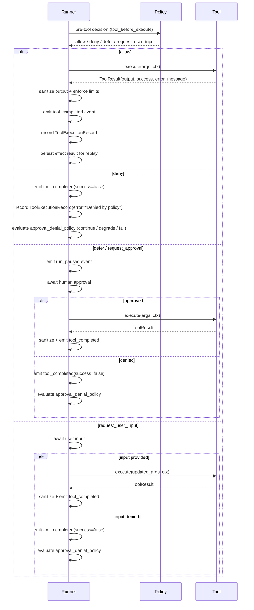

While the [Tools System Walkthrough](/library/tools-system-walkthrough) covers the
end-to-end pipeline, this page zooms into the event-level lifecycle of a single tool
call. Every tool invocation produces a deterministic sequence of events that flow through
the run handle. Understanding this sequence is critical for building observability
dashboards, audit logs, and human-in-the-loop approval flows.

A tool call begins when the runner receives a `ToolCall` from the LLM response. Before
the handler ever runs, the runner evaluates a policy gate that can allow, deny, or defer
the call for human approval. The outcome of that gate determines whether the tool
executes at all, and the events emitted along the way tell you exactly what happened and
why.

## Event timeline



## Event reference table

Every event is an `AgentRunEvent` published on the run handle. The `type` field
identifies the event, and the `data` dict carries event-specific fields.

| Event type | When it fires | Key `data` fields | Description |
| --- | --- | --- | --- |
| `tool_batch_started` | After LLM response contains tool calls | `tool_call_count` | Signals the start of a batch of one or more tool calls from a single LLM turn. |
| `policy_decision` | After policy evaluation for each tool | `tool_name`, `action`, `reason` | Records the policy engine's decision for one tool call. Emitted for allow, deny, defer, and request_user_input actions. |
| `run_paused` | When a tool call requires human approval | `tool_name`, `reason`, `payload` | The run is suspended waiting for external input. Only emitted when policy returns `defer` or `request_approval`. |
| `run_resumed` | After human approval or denial is received | `approved` | The run resumes after the approval decision. |
| `tool_completed` | After each tool call resolves (success or failure) | `tool_name`, `success`, `output`, `error`, `tool_call_id` | The terminal event for one tool call. Always emitted regardless of whether the tool ran, was denied, or timed out. |
| `warning` | When non-fatal issues occur | `message` | Advisory events such as sandbox violations handled under a continue policy. |

## Policy decisions: allow, deny, defer, and request_user_input

The `PolicyEngine` evaluates a `PolicyEvent` with `event_type="tool_before_execute"` for
every tool call. The decision drives the rest of the lifecycle:

**allow** -- The tool executes immediately. No human interaction required. This is the
default when no policy rules match.

**deny** -- The tool is blocked. A `ToolExecutionRecord` with `success=False` and
`error="Denied by policy"` is recorded. The denied result is fed back to the model as a
tool message so it can adjust its behavior. After a denial, the runner consults
`fail_safe.approval_denial_policy` to decide the run-level outcome:

- `continue` (default) -- The run proceeds. The model sees the denial and may try a
  different approach.
- `degrade` -- The run transitions to a `degraded` state and terminates with a
  degradation message.
- `fail` -- The run raises an `AgentExecutionError` and transitions to `failed`.

**defer / request_approval** -- The runner pauses the run, emits a `run_paused` event,
and waits for the `InteractionProvider` to deliver an approval decision. If the provider
is `HeadlessInteractionProvider`, the configured `approval_fallback` (default: `deny`)
is used. The approval has a configurable timeout (`approval_timeout_s`, default 300s).

**request_user_input** -- Similar to defer, but instead of a yes/no approval, the runner
asks the user for a value (such as a confirmation code or corrected parameter). The
policy's `request_payload` can specify a `target_arg` field, and the user's input is
injected into the tool arguments before execution.

## Timing and latency tracking

Every tool execution is timed from the moment `registry.call()` is invoked to the moment
it returns. The latency is captured in milliseconds and recorded in two places:

1. **`ToolExecutionRecord.latency_ms`** -- Available on the `AgentResult.tool_executions`
   list after the run completes.

2. **Telemetry histogram** -- The `agent.tool_call.latency_ms` metric is emitted with
   attributes `tool_name`, `result` (success/error), and `source` (execute/replay).

For batch-level timing, the `agent.tool_batch.latency_ms` histogram captures the
wall-clock duration of the entire batch (all concurrent tool calls), with attributes for
`call_count` and `failure_count`.

Denied tool calls have no execution latency since the handler never runs.

## How denied tools affect the agent run

When a tool is denied, the model still receives feedback. The runner appends a tool
message to the conversation with the denial reason:

```json
{"success": false, "error": "Denied by policy", "tool_call_id": "call_abc123"}
```

This feedback loop is important: the model sees that its proposed action was rejected and
can adapt. In practice, models respond to denials by either rephrasing the request,
choosing a different tool, or providing a text-only response.

The run-level impact depends on `fail_safe.approval_denial_policy`:

| Policy | Behavior after denial |
| --- | --- |
| `continue` | Run proceeds normally. Model sees the denial and may self-correct. |
| `degrade` | Run transitions to `degraded` state and exits the step loop with a degradation message. |
| `fail` | Run raises `AgentExecutionError` and transitions to `failed` state. |

Multiple denials in a single batch are each evaluated independently. If any denial
triggers a `fail` or `degrade` policy, the remaining tool calls in the batch are skipped.
