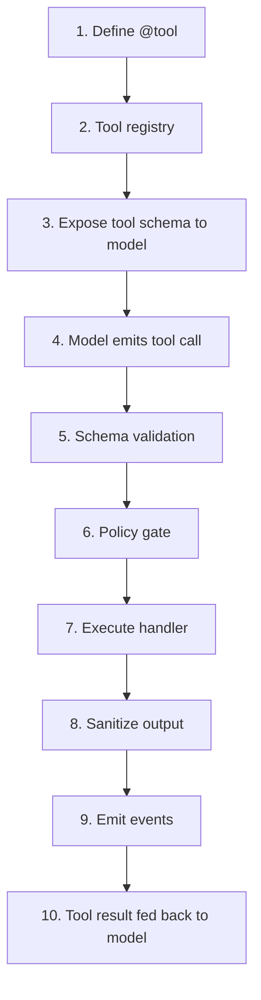

Every agent capability beyond pure text generation flows through the AFK tool system.
A tool starts as a decorated Python function, gets registered in a `ToolRegistry`,
has its JSON Schema exposed to the LLM, and then participates in a tightly controlled
loop: the model proposes a call, AFK validates the arguments, evaluates policy gates,
executes the handler, sanitizes the output, and feeds the result back into the
conversation for the model's next turn. This page walks through every stage of that
pipeline end-to-end.

## Registration to execution map



### Step-by-step breakdown

1. **Define `@tool`** -- You write a Python function and decorate it with `@tool`. The
   decorator extracts the function name, docstring, and a Pydantic model for its
   arguments to produce a `ToolSpec(name, description, parameters_schema)`.

2. **Tool registry** -- When the agent starts, all tools (declared on the agent plus
   runtime-injected extras like MCP tools and skill tools) are collected into a
   `ToolRegistry`. The registry is the single source of truth for tool lookup, schema
   export, and call dispatch.

3. **Expose tool schema to model** -- The registry converts every registered tool into
   the OpenAI function-calling format via `registry.to_openai_function_tools()`. This
   list is attached to the `LLMRequest.tools` field so the model knows what tools are
   available.

4. **Model emits tool call** -- The LLM response (`LLMResponse`) may contain one or
   more `ToolCall` objects. Each carries an `id`, a `tool_name`, and a JSON `arguments`
   dict. AFK processes these as a batch.

5. **Schema validation** -- Before execution, each tool call's raw arguments are
   validated against the tool's Pydantic `args_model` via `BaseTool.validate()`. If
   validation fails, a `ToolResult(success=False)` is returned immediately and the tool
   handler is never invoked.

6. **Policy gate** -- The runner evaluates the `PolicyEngine` for each tool call via a
   `tool_before_execute` policy event. The policy can `allow`, `deny`, `defer` (require
   human approval), or `request_user_input`. See the
   [Tool Call Lifecycle](/library/tool-call-lifecycle) page for the full decision matrix.

7. **Execute handler** -- If the policy allows execution, AFK runs the tool through the
   full hook/middleware chain: PreHooks (argument transforms) -> Middleware chain ->
   core handler -> PostHooks (output transforms). Timeout enforcement applies at every
   layer.

8. **Sanitize output** -- The raw `ToolResult.output` is passed through
   `apply_tool_output_limits()` which enforces `max_output_chars` and sandbox output
   policies. The runner then wraps the result in an untrusted-data content envelope via
   `render_untrusted_tool_message()` to prevent prompt injection from tool output.

9. **Emit events** -- A `tool_completed` event is emitted on the run handle, carrying
   the tool name, success flag, output, and any error. Telemetry counters and histograms
   are recorded for latency and success/failure counts.

10. **Tool result fed back to model** -- The sanitized output is appended to the
    conversation as a `Message(role="tool", name=tool_name, content=...)`. The loop
    returns to step 4 for the next LLM turn.

## Full example: tool definition through result inspection

```python
from pydantic import BaseModel
from afk.tools import tool, ToolContext
from afk.agents import Agent
from afk.core import Runner

# 1. Define a tool with a Pydantic args model
class SearchArgs(BaseModel):
    query: str
    max_results: int = 5

@tool(name="search_docs", description="Search internal documentation by query.")
def search_docs(args: SearchArgs, ctx: ToolContext) -> dict:
    """Search handler -- ctx gives you request_id, user_id, and metadata."""
    results = [{"title": f"Doc about {args.query}", "score": 0.95}]
    return {"results": results[:args.max_results]}

# 2. Create an agent with the tool
agent = Agent(
    name="ops-assistant",
    model="gpt-4.1-mini",
    instructions="Use search_docs when the user asks for references.",
    tools=[search_docs],
)

# 3. Run the agent
runner = Runner()
result = runner.run_sync(agent, user_message="Find docs about retry budgets")

# 4. Inspect the result
print(result.final_text)           # The model's final answer
print(result.state)                # "completed" or "degraded"
print(len(result.tool_executions)) # Number of tool calls made
```

## Inspecting tool executions

Every completed run exposes a `tool_executions` list on `AgentResult`. Each entry is a
`ToolExecutionRecord`:

| Field | Type | Description |
| --- | --- | --- |
| `tool_name` | `str` | Name of the executed tool. |
| `tool_call_id` | `str \| None` | Provider/LLM tool-call identifier. |
| `success` | `bool` | Whether execution succeeded. |
| `output` | `JSONValue \| None` | JSON-safe tool output payload. |
| `error` | `str \| None` | Error message when execution failed. |
| `latency_ms` | `float \| None` | Execution latency in milliseconds. |

```python
for rec in result.tool_executions:
    status = "ok" if rec.success else "FAILED"
    latency = f"{rec.latency_ms:.1f}ms" if rec.latency_ms else "n/a"
    print(f"[{status}] {rec.tool_name} ({latency})")
    if rec.error:
        print(f"  error: {rec.error}")
```

## Hook and middleware pipeline

Tools support three extension points that wrap the core handler:

| Extension | When it runs | Signature | Purpose |
| --- | --- | --- | --- |
| **PreHook** | Before core handler | `(args)` or `(args, ctx)` | Transform or validate arguments. Must return a dict compatible with the tool's args model. |
| **Middleware** | Wraps core handler | `(call_next, args, ctx)` | Cross-cutting concerns (logging, timing, caching). Calls `call_next(args, ctx)` to proceed. |
| **PostHook** | After core handler | `({"output": ..., "tool_name": ...})` | Transform or audit the output before it reaches the model. |

The execution order is: validate args -> run PreHooks sequentially -> run Middleware
chain (outermost first) -> core handler -> run PostHooks sequentially -> wrap in
`ToolResult`.

## Error handling

The tool system is designed to be non-throwing by default. `BaseTool.call()` catches all
exceptions and wraps them in a `ToolResult(success=False, error_message=...)` unless
`raise_on_error=True` is set on the tool.

**Validation errors** -- When the model passes arguments that do not match the Pydantic
schema, a `ToolValidationError` is caught and the error message is returned to the model
so it can self-correct on the next turn.

**Timeout errors** -- Each tool can set a `default_timeout` in seconds. If execution
exceeds this limit, an `asyncio.TimeoutError` is caught and surfaced as a
`ToolTimeoutError` in the result.

**Execution errors** -- Any unhandled exception from the handler, PreHook, or PostHook
is caught and wrapped in a `ToolExecutionError` result.

**Hook/middleware failures** -- If a PreHook returns a non-dict value or produces args
that fail re-validation against the main tool's model, execution stops and a failure
result is returned. PostHook failures similarly short-circuit the chain.

**Policy-driven behavior** -- After a tool failure, the runner consults the agent's
`fail_safe.tool_failure_policy` to decide whether to continue (default), degrade the
run, or fail the entire run. This is configurable per agent.
