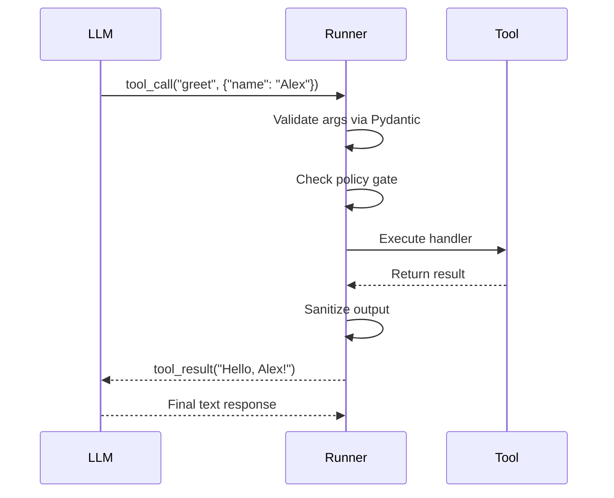

Tools let agents take actions — query databases, call APIs, run calculations, write files, or anything you can express in Python. AFK handles schema generation, argument validation, policy gates, execution, and output sanitization.

## Your first tool

```python
from pydantic import BaseModel
from afk.tools import tool

class GreetArgs(BaseModel):
    name: str

@tool(name="greet", description="Greet someone by name.")
def greet(args: GreetArgs) -> str:
    return f"Hello, {args.name}!"
```

That's a complete tool. The `@tool` decorator generates the JSON schema from the Pydantic model, which the LLM uses to understand what arguments to pass.

## How tool calling works



<Steps>
  <Step title="LLM decides to call a tool">
    Based on the user's message and the tool schemas, the LLM emits a
    `tool_call` with the function name and arguments.
  </Step>
  <Step title="Validate arguments">
    AFK parses the arguments through the Pydantic model. Invalid arguments
    generate a validation error that's sent back to the LLM for self-correction.
  </Step>
  <Step title="Check policy gate">
    If a [PolicyEngine](/library/security-model) is attached, the tool call is
    checked against policy rules (`allow`, `deny`, or `request_approval`).
  </Step>
  <Step title="Execute the handler">
    The tool function runs with validated arguments. Pre/post hooks and
    middleware execute around the handler.
  </Step>
  <Step title="Sanitize output">
    The output is truncated to `tool_output_max_chars`, stripped of potential
    prompt injection vectors (if `sanitize_tool_output=True`), and formatted for
    the LLM.
  </Step>
  <Step title="Return to LLM">
    The sanitized result is appended to the conversation and the LLM generates
    its next response.
  </Step>
</Steps>

## Tool patterns

<Tabs>
  <Tab title="Simple return">
    Return a string or dict directly.

    ```python
    class TimeArgs(BaseModel):
        timezone: str = "UTC"

    @tool(name="current_time", description="Get the current time.")
    def current_time(args: TimeArgs) -> str:
        from datetime import datetime, timezone
        return datetime.now(timezone.utc).isoformat()
    ```

  </Tab>
  <Tab title="Structured output">
    Return a dict for structured data.

    ```python
    class SearchArgs(BaseModel):
        query: str
        limit: int = 5

    @tool(name="search", description="Search the knowledge base.")
    def search(args: SearchArgs) -> dict:
        results = db.search(args.query, limit=args.limit)
        return {
            "count": len(results),
            "results": [{"title": r.title, "score": r.score} for r in results],
        }
    ```

  </Tab>
  <Tab title="Async tool">
    Use `async def` for I/O-heavy tools.

    ```python
    class FetchArgs(BaseModel):
        url: str

    @tool(name="fetch_page", description="Fetch a web page.")
    async def fetch_page(args: FetchArgs) -> dict:
        async with httpx.AsyncClient() as client:
            resp = await client.get(args.url)
            return {"status": resp.status_code, "body": resp.text[:2000]}
    ```

  </Tab>
  <Tab title="With context">
    Access agent context in tool handlers.

    ```python
    class DBArgs(BaseModel):
        query: str

    @tool(name="query_db", description="Run a database query.")
    def query_db(args: DBArgs, context: dict) -> dict:
        db_url = context["db_url"]  # ← Set in Agent(context={"db_url": "..."})
        return execute_query(db_url, args.query)
    ```

  </Tab>
</Tabs>

## Read-only vs mutating tools

Mark tools as read-only or mutating to guide policy decisions:

```python
@tool(name="list_files", description="List files in a directory.", read_only=True)
def list_files(args: ListArgs) -> list:
    ...

@tool(name="delete_file", description="Delete a file.", read_only=False)
def delete_file(args: DeleteArgs) -> dict:
    ...
```

<Tip>
  **Policy best practice:** Gate all mutating tools with `request_approval` or
  `deny` by default. Only allow read-only tools without gates.
</Tip>

## Hooks and middleware

Add pre/post hooks to tools for logging, validation, or transformation:

```python
from afk.tools import tool, before_tool, after_tool

@before_tool("*")  # ← Runs before every tool call
def log_tool_call(event):
    print(f"Calling {event.tool_name} with {event.args}")

@after_tool("*")   # ← Runs after every tool call
def log_tool_result(event):
    print(f"{event.tool_name} returned in {event.latency_ms:.0f}ms")
```

<AccordionGroup>
  <Accordion title="Hook execution order">
    1. **Before hooks** (global `*` hooks first, then tool-specific)
    2. **Policy gate** (allow / deny / request_approval)
    3. **Tool handler** (the actual function)
    4. **After hooks** (tool-specific first, then global `*`)
    5. **Output sanitization**
  </Accordion>
  <Accordion title="Tool middleware">
    Middleware wraps the entire tool execution pipeline:

    ```python
    from afk.tools import tool_middleware

    @tool_middleware
    async def timing_middleware(call, next_handler):
        start = time.time()
        result = await next_handler(call)
        elapsed = time.time() - start
        print(f"{call.tool_name} took {elapsed:.3f}s")
        return result
    ```

  </Accordion>
</AccordionGroup>

## Common tools cookbook

<AccordionGroup>
  <Accordion title="HTTP request tool">
    ```python
    class HttpArgs(BaseModel):
        method: str = "GET"
        url: str
        body: dict | None = None

    @tool(name="http_request", description="Make an HTTP request.")
    async def http_request(args: HttpArgs) -> dict:
        async with httpx.AsyncClient(timeout=10) as client:
            resp = await client.request(args.method, args.url, json=args.body)
            return {"status": resp.status_code, "body": resp.text[:4000]}
    ```

  </Accordion>
  <Accordion title="File read tool">
    ```python
    class ReadFileArgs(BaseModel):
        path: str
        max_lines: int = 100

    @tool(name="read_file", description="Read a file's contents.", read_only=True)
    def read_file(args: ReadFileArgs) -> dict:
        with open(args.path) as f:
            lines = f.readlines()[:args.max_lines]
        return {"content": "".join(lines), "total_lines": len(lines)}
    ```

  </Accordion>
  <Accordion title="Calculator tool">
    ```python
    class CalcArgs(BaseModel):
        expression: str

    @tool(name="calculate", description="Evaluate a math expression.")
    def calculate(args: CalcArgs) -> dict:
        import ast
        result = eval(compile(ast.parse(args.expression, mode='eval'), '<calc>', 'eval'))
        return {"expression": args.expression, "result": result}
    ```

  </Accordion>
</AccordionGroup>

## Next steps

<CardGroup cols={2}>
  <Card title="Streaming" icon="signal" href="/library/streaming">
    Watch tool calls happen in real time.
  </Card>
  <Card title="Security Model" icon="shield" href="/library/security-model">
    Policy gates, sandbox profiles, and tool allowlists.
  </Card>
</CardGroup>
