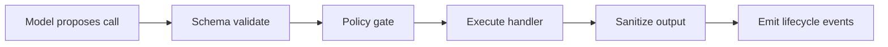

Tools are how agents interact with the outside world. Every time an agent needs to do something beyond generating text — calling an API, querying a database, running a computation, sending a notification — it does it through a tool.

AFK treats tools as the **side-effect surface** of your agent system. Because tools are where real-world consequences happen, the tool system is designed with safety, validation, and auditability as first-class concerns.

## How Tool Calls Work

When an agent calls a tool, the call goes through a multi-step pipeline before your handler function runs. Each step in the pipeline adds a layer of safety.



Here is what happens at each step:

1. **Model proposes call** — The LLM sees the tool's JSON schema in its context and decides to call it, providing arguments as JSON.

2. **Schema validate** — AFK validates the LLM's arguments against your tool's Pydantic `args_model`. If the arguments are malformed (wrong types, missing required fields, extra fields), the call is rejected before your handler runs. You never need to validate input inside your tool function.

3. **Policy gate** — The runner's policy engine evaluates whether this tool call should be allowed. The policy can `allow` the call, `deny` it (with a reason), or `request_approval` from a human operator. This is how you enforce guardrails like "never allow database writes in staging" or "require human approval for financial transactions."

4. **Execute handler** — Your tool function runs with the validated, typed arguments. If the tool raises an exception, it is caught and recorded as a failed tool execution.

5. **Sanitize output** — The tool's return value is sanitized before being sent back to the LLM. This includes truncating overly large outputs (configurable via `tool_output_max_chars` in `RunnerConfig`) and ensuring the output is JSON-serializable.

6. **Emit lifecycle events** — AFK emits telemetry events for every tool call, recording the tool name, arguments, output, success/failure status, and latency. These events are captured by your telemetry sink for observability.

## Defining Tools

Every tool in AFK follows the same pattern: a Pydantic model for arguments and a handler function that takes those arguments and returns a result.

```python
from pydantic import BaseModel, Field
from afk.tools import tool

class RestartArgs(BaseModel):
    service: str = Field(description="Name of the service to restart")
    force: bool = Field(default=False, description="Force restart without graceful shutdown")

@tool(args_model=RestartArgs, name="restart_service")
def restart_service(args: RestartArgs) -> dict[str, str]:
    """Restart a service by name."""
    if args.force:
        return {"status": "force_restarted", "service": args.service}
    return {"status": "restarted", "service": args.service}
```

The `@tool` decorator does several things:

- Generates a JSON schema from your `RestartArgs` model, which is included in the LLM's context so it knows how to call the tool
- Wraps your function with validation, error handling, and lifecycle event emission
- Makes the tool compatible with AFK's tool registry and middleware system

The Pydantic model's `Field` descriptions are included in the generated JSON schema, which helps the LLM understand what each argument does. Good field descriptions lead to more accurate tool calls.

## Tool Results

Every tool execution produces a `ToolResult` that captures the outcome:

```python
from afk.tools.core.base import ToolResult

# On success:
ToolResult(output={"status": "restarted", "service": "api"}, success=True, tool_name="restart_service")

# On failure:
ToolResult(output=None, success=False, error_message="Service not found", tool_name="restart_service")
```

The `ToolResult` is sent back to the LLM as the tool's response, and it is also recorded in `AgentResult.tool_executions` as a `ToolExecutionRecord` with additional metadata like latency and tool call ID.

## Hooks and Middleware

For cross-cutting concerns — logging, rate limiting, access control, argument transformation — AFK supports **pre-hooks**, **post-hooks**, and **middleware** on tools.

**Pre-hooks** run before the tool handler. They can inspect or transform the arguments, or reject the call entirely.

**Post-hooks** run after the tool handler. They can inspect or transform the output.

**Middleware** wraps the entire tool execution, giving you full control over the call chain (similar to middleware in web frameworks).

```python
from afk.tools.core.base import PreHook, PostHook, Middleware

class AuditLogHook(PreHook):
    """Log every tool call to an audit trail."""
    async def call(self, raw_args, *, ctx=None, **kwargs):
        print(f"[AUDIT] Tool called with args: {raw_args}")
        return ToolResult(output=raw_args, success=True)

class SensitiveFieldRedactor(PostHook):
    """Redact sensitive fields from tool output before sending to LLM."""
    async def call(self, raw_args, *, ctx=None, **kwargs):
        output = raw_args  # post-hooks receive the tool's output
        if isinstance(output, dict) and "password" in output:
            output["password"] = "***REDACTED***"
        return ToolResult(output=output, success=True)
```

Use hooks and middleware sparingly — they add complexity. The most common use cases are audit logging, field redaction, and rate limiting.

## Read-Only vs. Mutating Tools

A useful design pattern is to separate your tools into read-only (safe to call without approval) and mutating (may need policy gates or human approval).

| Type | Examples | Typical policy |
|---|---|---|
| **Read-only** | `lookup_ticket`, `search_docs`, `get_metrics` | Allow without approval |
| **Mutating** | `restart_service`, `delete_record`, `deploy_release` | Require approval or restrict by environment |

This separation makes it easier to write policy rules: allow all read-only tools, require approval for mutating tools, deny mutating tools in production unless the operator has admin role.

## Builder Checklist

When designing tools for your AFK system:

- **Keep tool schemas minimal and explicit.** Only include fields the tool actually needs. Do not pass entire request contexts or large payloads as tool arguments.
- **Return JSON-safe results.** Dicts, lists, strings, numbers, booleans, and `None`. Avoid returning complex objects that cannot be serialized.
- **Separate read-only tools from mutating tools.** This makes policy rules cleaner and reduces the approval burden on operators.
- **Add policy checks for privileged operations.** Any tool that modifies state, costs money, or has irreversible effects should go through a policy gate.
- **Design for idempotency.** If a tool call might be retried (due to checkpointing and resume), its handler should produce the same result when called twice with the same arguments.

## For Coding Agents

When creating tools automatically (e.g., with an AI coding agent):

1. **Always generate a strict args model.** Every tool must have a Pydantic `BaseModel` with explicit field types and descriptions.
2. **Avoid dynamic `Any` payloads.** If you use `Any` in your args model, the LLM has no schema guidance and will guess at the structure.
3. **Include a failure-return shape.** Make sure your tool function handles errors gracefully and returns a structured error result, rather than raising unhandled exceptions.
