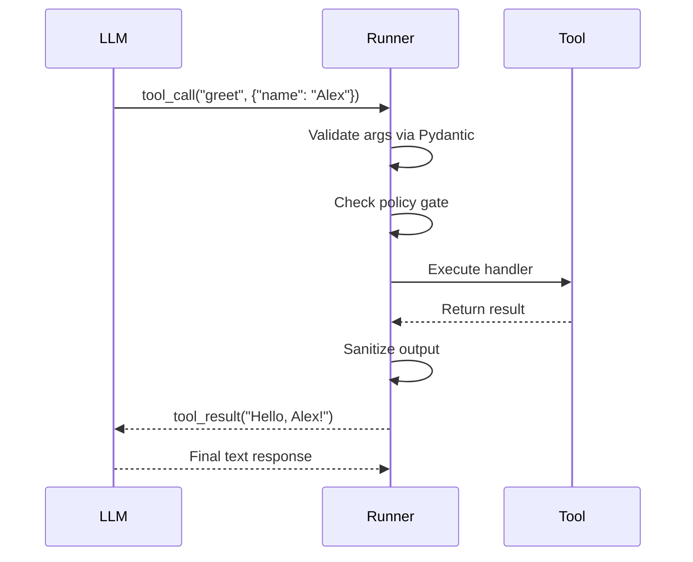
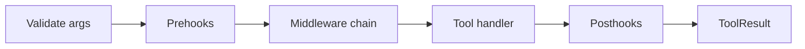

Tools let agents take actions — query databases, call APIs, run calculations, write files, or anything you can express in Python. AFK handles schema generation, argument validation, policy gates, execution, and output sanitization.

## Your first tool

```python
from pydantic import BaseModel
from afk.tools import tool

class GreetArgs(BaseModel):
    name: str

@tool(args_model=GreetArgs, name="greet", description="Greet someone by name.")
def greet(args: GreetArgs) -> str:
    return f"Hello, {args.name}!"
```

That's a complete tool. The `@tool` decorator generates the JSON schema from the Pydantic model, which the LLM uses to understand what arguments to pass.

## How tool calling works



<Steps>
  <Step title="LLM decides to call a tool">
    Based on the user's message and the tool schemas, the LLM emits a
    `tool_call` with the function name and arguments.
  </Step>
  <Step title="Validate arguments">
    AFK parses the arguments through the Pydantic model. Invalid arguments
    generate a validation error that's sent back to the LLM for self-correction.
  </Step>
  <Step title="Check policy gate">
    If a [PolicyEngine](/library/security-model) is attached, the tool call is
    checked against policy rules (`allow`, `deny`, or `request_approval`).
  </Step>
  <Step title="Execute the handler">
    The tool function runs with validated arguments. Pre/post hooks and
    middleware execute around the handler.
  </Step>
  <Step title="Sanitize output">
    The output is truncated to `tool_output_max_chars`, stripped of potential
    prompt injection vectors (if `sanitize_tool_output=True`), and formatted for
    the LLM.
  </Step>
  <Step title="Return to LLM">
    The sanitized result is appended to the conversation and the LLM generates
    its next response.
  </Step>
</Steps>

## Tool patterns

<Tabs>
  <Tab title="Simple return">
    Return a string or dict directly.

    ```python
    class TimeArgs(BaseModel):
        timezone: str = "UTC"

    @tool(args_model=TimeArgs, name="current_time", description="Get the current time.")
    def current_time(args: TimeArgs) -> str:
        from datetime import datetime, timezone
        return datetime.now(timezone.utc).isoformat()
    ```

  </Tab>
  <Tab title="Structured output">
    Return a dict for structured data.

    ```python
    class SearchArgs(BaseModel):
        query: str
        limit: int = 5

    @tool(args_model=SearchArgs, name="search", description="Search the knowledge base.")
    def search(args: SearchArgs) -> dict:
        results = db.search(args.query, limit=args.limit)
        return {
            "count": len(results),
            "results": [{"title": r.title, "score": r.score} for r in results],
        }
    ```

  </Tab>
  <Tab title="Async tool">
    Use `async def` for I/O-heavy tools.

    ```python
    class FetchArgs(BaseModel):
        url: str

    @tool(args_model=FetchArgs, name="fetch_page", description="Fetch a web page.")
    async def fetch_page(args: FetchArgs) -> dict:
        async with httpx.AsyncClient() as client:
            resp = await client.get(args.url)
            return {"status": resp.status_code, "body": resp.text[:2000]}
    ```

  </Tab>
  <Tab title="With context">
    Access `ToolContext` in tool handlers. The second parameter must be named `ctx` or annotated as `ToolContext`.

    ```python
    from afk.tools import tool, ToolContext

    class DBArgs(BaseModel):
        query: str

    @tool(args_model=DBArgs, name="query_db", description="Run a database query.")
    def query_db(args: DBArgs, ctx: ToolContext) -> dict:
        user = ctx.user_id              # ← Set by the runner
        meta = ctx.metadata             # ← Custom metadata dict
        return execute_query(args.query)
    ```

  </Tab>
</Tabs>

## Policy-gated tools

Use the [PolicyEngine](/library/security-model) to gate sensitive tool calls:

```python
from afk.agents import Agent, PolicyEngine, PolicyRule

agent = Agent(
    name="ops",
    model="gpt-4.1-mini",
    tools=[list_files, delete_file],
    policy_engine=PolicyEngine(rules=[
        PolicyRule(
            rule_id="gate-mutations",
            condition=lambda e: e.tool_name in ("delete_file", "write_file"),
            action="request_approval",
            reason="Destructive action requires approval",
        ),
    ]),
)
```

<Tip>
  **Policy best practice:** Gate all mutating tools with `request_approval` or
  `deny` by default. Only allow read-only tools without gates.
</Tip>

## Hooks and middleware

AFK provides four extension points for tool execution: **prehooks**, **posthooks**, **tool-level middleware**, and **registry-level middleware**. Each has its own decorator.

<AccordionGroup>
  <Accordion title="Prehooks — transform args before execution" icon="filter" defaultOpen>
    Prehooks run before the tool handler. They receive the tool's arguments and **must return a dict** compatible with the tool's `args_model`.

    ```python
    from afk.tools import prehook

    class SearchArgs(BaseModel):
        query: str
        max_results: int = 10

    @prehook(args_model=SearchArgs, name="normalize_query")
    def normalize_query(args: SearchArgs) -> dict:
        return {
            "query": args.query.lower().strip(),
            "max_results": min(args.max_results, 50),
        }

    # Attach to a tool via the prehooks= parameter:
    @tool(
        args_model=SearchArgs,
        name="search",
        description="Search knowledge base.",
        prehooks=[normalize_query],
    )
    def search(args: SearchArgs) -> dict:
        return {"results": [...]}  # args are already normalized
    ```

  </Accordion>

  <Accordion title="Posthooks — transform output after execution" icon="wand-magic-sparkles">
    Posthooks run after the tool handler. They receive a dict `{"output": <tool_output>, "tool_name": "<name>"}` and should return a dict with the same shape.

    ```python
    from afk.tools import posthook
    from typing import Any

    class PostArgs(BaseModel):
        output: Any
        tool_name: str | None = None

    @posthook(args_model=PostArgs, name="redact_secrets")
    def redact_secrets(args: PostArgs) -> dict:
        output = args.output
        if isinstance(output, dict):
            output = {k: v for k, v in output.items() if k not in ("secret", "token")}
        return {"output": output, "tool_name": args.tool_name}
    ```

  </Accordion>

  <Accordion title="Tool-level middleware — wrap execution" icon="layer-group">
    Middleware wraps the entire tool execution. It receives `call_next`, the validated args, and optionally `ctx`.

    ```python
    from afk.tools import middleware
    import time

    @middleware(name="timing")
    async def timing(call_next, args, ctx):
        start = time.monotonic()
        result = await call_next(args, ctx)
        print(f"Tool took {(time.monotonic() - start)*1000:.0f}ms")
        return result

    # Attach via middlewares= parameter:
    @tool(
        args_model=SearchArgs,
        name="search",
        description="Search.",
        middlewares=[timing],
    )
    def search(args: SearchArgs) -> dict:
        ...
    ```

  </Accordion>

  <Accordion title="Registry-level middleware — wrap all tools" icon="globe">
    Registry-level middleware applies to **every tool** in a `ToolRegistry`. Use for audit logging, rate limiting, or global policy enforcement.

    ```python
    from afk.tools import registry_middleware

    @registry_middleware(name="audit_log")
    async def audit_log(call_next, tool, raw_args, ctx):
        print(f"AUDIT: {tool.spec.name} called")
        result = await call_next(tool, raw_args, ctx)
        print(f"AUDIT: {tool.spec.name} success={result.success}")
        return result
    ```

  </Accordion>
</AccordionGroup>

### Execution order



| Layer           | Scope                       | Decorator                        | Returns                        |
| --------------- | --------------------------- | -------------------------------- | ------------------------------ |
| **Prehook**     | Single tool, before handler | `@prehook(args_model=...)`       | `dict` of transformed args     |
| **Middleware**  | Single tool, wraps handler  | `@middleware(name=...)`          | Tool output (via `call_next`)  |
| **Posthook**    | Single tool, after handler  | `@posthook(args_model=...)`      | `dict` with `output` key       |
| **Registry MW** | All tools in registry       | `@registry_middleware(name=...)` | `ToolResult` (via `call_next`) |

## Common tools cookbook

<AccordionGroup>
  <Accordion title="HTTP request tool">
    ```python
    class HttpArgs(BaseModel):
        method: str = "GET"
        url: str
        body: dict | None = None

    @tool(args_model=HttpArgs, name="http_request", description="Make an HTTP request.")
    async def http_request(args: HttpArgs) -> dict:
        async with httpx.AsyncClient(timeout=10) as client:
            resp = await client.request(args.method, args.url, json=args.body)
            return {"status": resp.status_code, "body": resp.text[:4000]}
    ```

  </Accordion>
  <Accordion title="File read tool">
    ```python
    class ReadFileArgs(BaseModel):
        path: str
        max_lines: int = 100

    @tool(args_model=ReadFileArgs, name="read_file", description="Read a file's contents.")
    def read_file(args: ReadFileArgs) -> dict:
        with open(args.path) as f:
            lines = f.readlines()[:args.max_lines]
        return {"content": "".join(lines), "total_lines": len(lines)}
    ```

  </Accordion>
  <Accordion title="Calculator tool">
    ```python
    class CalcArgs(BaseModel):
        expression: str

    @tool(args_model=CalcArgs, name="calculate", description="Evaluate a math expression.")
    def calculate(args: CalcArgs) -> dict:
        import ast
        result = eval(compile(ast.parse(args.expression, mode='eval'), '<calc>', 'eval'))
        return {"expression": args.expression, "result": result}
    ```

  </Accordion>
</AccordionGroup>

## Next steps

<CardGroup cols={2}>
  <Card title="Streaming" icon="signal" href="/library/streaming">
    Watch tool calls happen in real time.
  </Card>
  <Card title="Security Model" icon="shield" href="/library/security-model">
    Policy gates, sandbox profiles, and tool allowlists.
  </Card>
</CardGroup>
