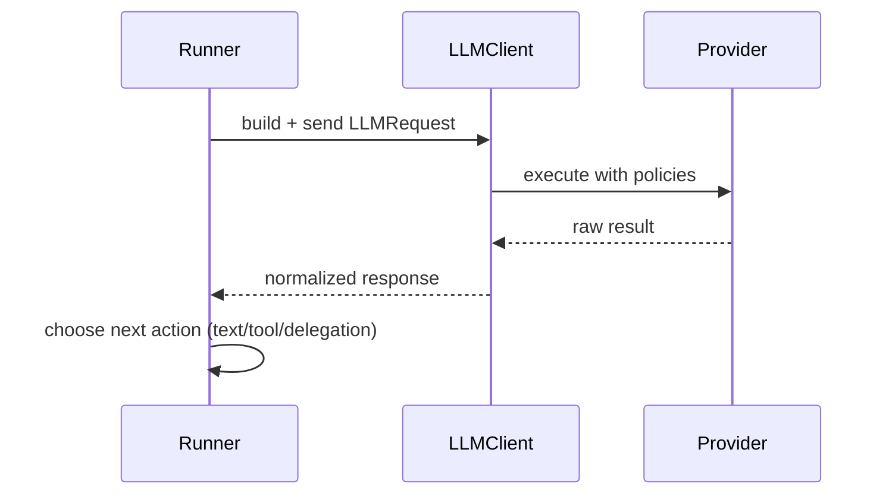

## Integration sequence


```mermaid
sequenceDiagram
    participant Runner
    participant LLMClient
    participant Provider

    Runner->>LLMClient: build + send LLMRequest
    LLMClient->>Provider: execute with policies
    Provider-->>LLMClient: raw result
    LLMClient-->>Runner: normalized response
    Runner->>Runner: choose next action (text/tool/delegation)
```

## Example

```python
runner = Runner(llm_client=client)
result = runner.run_sync(agent, user_message="Create a postmortem outline")
```
