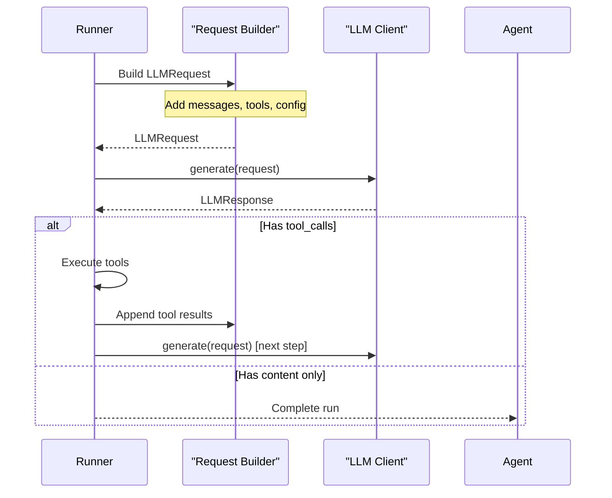

This page explains how agents connect to the LLM layer — from model resolution to request construction, streaming, and error handling.

## Model resolution

Agents can specify their model in two ways:

<Tabs>
  <Tab title="Model name (auto-resolved)">
    Pass a model name string. AFK resolves it to an LLM client using the default provider.

    ```python
    agent = Agent(name="demo", model="gpt-4.1-mini", ...)
    ```

    The resolution order:
    1. Check `agent.model_resolver` (custom function)
    2. Check registered adapters for matching provider prefix
    3. Default to OpenAI adapter

  </Tab>
  <Tab title="Pre-built client">
    Pass a pre-configured `LLMClient` for full control over provider settings.

    ```python
    from afk.llms import LLMBuilder

    client = (
        LLMBuilder()
        .provider("openai")
        .model("gpt-4.1-mini")
        .profile("production")
        .build()
    )

    agent = Agent(name="demo", model=client, ...)
    ```

  </Tab>
</Tabs>

## How the runner uses the LLM

On each step of the agent loop:



## Request construction

The runner builds an `LLMRequest` from multiple sources:

| Source               | Contributes             | Priority |
| -------------------- | ----------------------- | -------- |
| `Agent.instructions` | System message          | Highest  |
| Thread history       | Previous messages       | —        |
| `user_message`       | User message            | —        |
| `Agent.tools`        | Tool schemas            | —        |
| `Agent.subagents`    | Transfer tool schemas   | —        |
| `RunnerConfig`       | Temperature, max_tokens | Lowest   |

## Streaming integration

When using `run_stream()`, the runner passes through streaming events from the LLM:

```python
handle = await runner.run_stream(agent, user_message="Explain DNS")

async for event in handle:
    match event.type:
        case "text_delta":
            # ← Comes from LLM streaming
            print(event.text_delta, end="")
        case "tool_started":
            # ← Comes from the runner
            print(f"\n🔧 {event.tool_name}")
```

`text_delta` events are generated by the LLM adapter's `generate_stream()` method. Tool and step events are generated by the runner.

## Error handling

LLM errors are classified and handled automatically:

| Error                        | Classification | Runner behavior            |
| ---------------------------- | -------------- | -------------------------- |
| Rate limit (429)             | Retryable      | Retry with backoff         |
| Server error (500, 502, 503) | Retryable      | Retry with backoff         |
| Auth error (401, 403)        | Terminal       | Fail the run               |
| Invalid request (400)        | Terminal       | Fail the run               |
| Timeout                      | Retryable      | Retry (if attempts remain) |
| Circuit breaker open         | Terminal       | Try fallback model or fail |
| All retries exhausted        | Terminal       | Try fallback model or fail |

## Model selection guide

| Task                       | Recommended model              | Why                                 |
| -------------------------- | ------------------------------ | ----------------------------------- |
| Simple Q&A, classification | `gpt-4.1-nano`                 | Fast, cheap, good enough            |
| General purpose with tools | `gpt-4.1-mini`                 | Best balance of cost and capability |
| Complex reasoning, coding  | `gpt-4.1` or `claude-4-sonnet` | Better at multi-step reasoning      |
| Cost-sensitive batch       | `gpt-4.1-nano`                 | Lowest cost per token               |
| Maximum quality            | `gpt-4.1` + `temperature=0.0`  | Deterministic, highest quality      |

## Next steps

<CardGroup cols={2}>
  <Card title="Core Runner" icon="play" href="/library/core-runner">
    The step loop and execution engine.
  </Card>
  <Card title="Streaming" icon="signal" href="/library/streaming">
    Real-time event streaming API.
  </Card>
</CardGroup>
