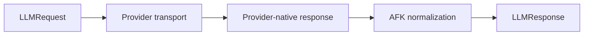

## Request/response contract



## Better structured-output example

```python
from pydantic import BaseModel
from afk.llms.types import LLMRequest, Message

class IncidentSummary(BaseModel):
    severity: str
    summary: str

resp = await client.chat(
    LLMRequest(messages=[Message(role="user", content="Summarize this incident")]),
    response_model=IncidentSummary,
)
```
