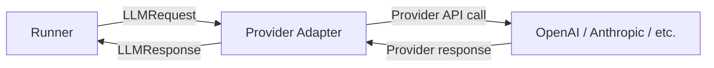

Every LLM interaction in AFK flows through two typed contracts: `LLMRequest` (what you send) and `LLMResponse` (what you get back). These contracts normalize the differences between providers so your agent code never touches provider-specific types.

## The flow



The adapter translates between AFK's normalized contracts and the provider's native format.

## LLMRequest

<Tabs>
  <Tab title="Fields">
    | Field | Type | Purpose |
    | --- | --- | --- |
    | `messages` | `list[Message]` | Conversation history (system, user, assistant, tool) |
    | `model` | `str` | Model identifier |
    | `tools` | `list[ToolSchema]` | Available tool schemas |
    | `temperature` | `float` | Sampling temperature (0.0–2.0) |
    | `max_tokens` | `int \| None` | Max output tokens |
    | `top_p` | `float \| None` | Nucleus sampling |
    | `response_format` | `ResponseFormat \| None` | Structured output format |
    | `stop` | `list[str] \| None` | Stop sequences |
  </Tab>
  <Tab title="Example">
    ```python
    from afk.llms import LLMRequest, Message

    request = LLMRequest(
        messages=[
            Message(role="system", content="You are a helpful assistant."),
            Message(role="user", content="What is Python?"),
        ],
        model="gpt-4.1-mini",
        temperature=0.7,
        max_tokens=500,
    )
    ```

  </Tab>
</Tabs>

## LLMResponse

<Tabs>
  <Tab title="Fields">
    | Field | Type | Purpose |
    | --- | --- | --- |
    | `content` | `str \| None` | Text response from the model |
    | `tool_calls` | `list[ToolCall]` | Tool calls requested by the model |
    | `model` | `str` | Model that generated the response |
    | `usage` | `Usage` | Token counts (prompt, completion, total) |
    | `finish_reason` | `str` | Why generation stopped (`stop`, `tool_calls`, `length`) |
    | `latency_ms` | `float` | End-to-end request latency |
  </Tab>
  <Tab title="Example">
    ```python
    response = await client.generate(request)

    print(response.content)        # "Python is a high-level programming..."
    print(response.usage.total)    # 142 tokens
    print(response.finish_reason)  # "stop"
    print(response.latency_ms)     # 823.4
    ```

  </Tab>
</Tabs>

## Structured output

Request structured JSON output with a Pydantic model:

```python
from pydantic import BaseModel

class Sentiment(BaseModel):
    label: str      # "positive", "negative", "neutral"
    confidence: float
    reasoning: str

request = LLMRequest(
    messages=[Message(role="user", content="I love this product!")],
    model="gpt-4.1-mini",
    response_format=Sentiment,   # ← Forces structured JSON output
)

response = await client.generate(request)
result = Sentiment.model_validate_json(response.content)
print(result.label)       # "positive"
print(result.confidence)  # 0.95
```

## Message types

| Role        | Purpose            | Source                        |
| ----------- | ------------------ | ----------------------------- |
| `system`    | Agent instructions | From `Agent.instructions`     |
| `user`      | User input         | From `user_message` parameter |
| `assistant` | Model responses    | Generated by the LLM          |
| `tool`      | Tool results       | From tool execution           |

## Next steps

<CardGroup cols={2}>
  <Card title="Adapters" icon="plug" href="/llms/adapters">
    Built-in providers and custom adapters.
  </Card>
  <Card
    title="Control & Session"
    icon="sliders"
    href="/llms/control-and-session"
  >
    Retry, caching, rate limiting, and circuit breaking.
  </Card>
</CardGroup>
