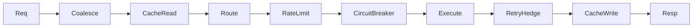

## Policy order

## Tuning playbook

<Tabs>
  <Tab title="Interactive UX">
    lower timeout, enable hedging, short retry budget
  </Tab>
  <Tab title="Batch jobs">
    higher timeout, larger retry budget, cost-aware routing
  </Tab>
  <Tab title="Cost-sensitive">
    cache + coalescing + cheaper primary model with fallback
  </Tab>
</Tabs>

## For Coding Agents

When generating LLM request code:

- set explicit timeout/retry defaults
- avoid provider-specific payload shapes in app layer
- keep fallback chains explicit
