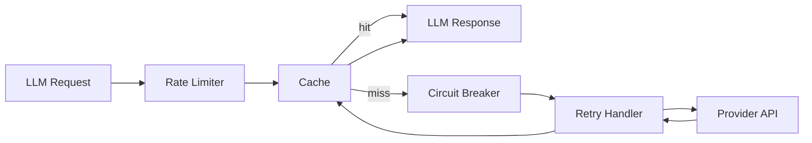

The LLM runtime includes built-in policies for handling transient failures, managing costs, and protecting against provider outages. Configure them via the builder profile or individual policy settings.

## Policy pipeline

Every LLM request passes through this policy chain:



## Built-in profiles

Use `profile()` to apply a curated set of policies:

```python
from afk.llms import LLMBuilder

# Development: no retry, no caching, fast failures
dev = LLMBuilder().provider("openai").model("gpt-4.1-mini").profile("development").build()

# Production: retry, circuit breaker, rate limiting, caching
prod = LLMBuilder().provider("openai").model("gpt-4.1-mini").profile("production").build()
```

| Profile       | Retry                           | Cache               | Rate Limit | Circuit Breaker        | Timeout |
| ------------- | ------------------------------- | ------------------- | ---------- | ---------------------- | ------- |
| `development` | None                            | None                | None       | None                   | 30s     |
| `production`  | 3 attempts, exponential backoff | In-memory, 5min TTL | 60 req/min | 5 failures → 30s open  | 60s     |
| `batch`       | 5 attempts, longer backoff      | None                | 20 req/min | 10 failures → 60s open | 120s    |

## Individual policies

Configure each policy independently:

<Tabs>
  <Tab title="Retry">
    Retry transient LLM failures with exponential backoff.

    ```python
    client = (
        LLMBuilder()
        .provider("openai")
        .model("gpt-4.1-mini")
        .retry(max_attempts=3, backoff_base=1.0, backoff_max=30.0)
        .build()
    )
    ```

    | Parameter | Default | Description |
    | --- | --- | --- |
    | `max_attempts` | 3 | Total attempts (1 initial + 2 retries) |
    | `backoff_base` | 1.0 | Initial delay in seconds |
    | `backoff_max` | 30.0 | Maximum delay between retries |
    | `retryable_errors` | `[429, 500, 502, 503]` | HTTP status codes to retry |

  </Tab>
  <Tab title="Circuit breaker">
    Stop calling a failing provider to prevent cascading failures.

    ```python
    client = (
        LLMBuilder()
        .provider("openai")
        .model("gpt-4.1-mini")
        .circuit_breaker(failure_threshold=5, recovery_timeout=30.0)
        .build()
    )
    ```

    ```mermaid
    stateDiagram-v2
        [*] --> Closed: normal operation
        Closed --> Open: failure_threshold exceeded
        Open --> HalfOpen: recovery_timeout elapsed
        HalfOpen --> Closed: test request succeeds
        HalfOpen --> Open: test request fails
    ```

  </Tab>
  <Tab title="Rate limiting">
    Prevent exceeding provider rate limits.

    ```python
    client = (
        LLMBuilder()
        .provider("openai")
        .model("gpt-4.1-mini")
        .rate_limit(requests_per_minute=60, tokens_per_minute=100_000)
        .build()
    )
    ```

  </Tab>
  <Tab title="Caching">
    Cache identical requests to reduce cost and latency.

    ```python
    client = (
        LLMBuilder()
        .provider("openai")
        .model("gpt-4.1-mini")
        .cache(ttl_seconds=300, max_entries=1000)
        .build()
    )
    ```

    Cache keys are derived from the request content (messages, model, temperature, tools). Identical requests return cached responses.

  </Tab>
  <Tab title="Timeout">
    Hard timeout on LLM requests.

    ```python
    client = (
        LLMBuilder()
        .provider("openai")
        .model("gpt-4.1-mini")
        .timeout(connect_s=5.0, read_s=60.0)
        .build()
    )
    ```

  </Tab>
</Tabs>

## Fallback chains

Configure a chain of models to try when the primary model fails:

```python
from afk.agents import Agent, FailSafeConfig

agent = Agent(
    name="resilient",
    model="gpt-4.1",
    fail_safe=FailSafeConfig(
        fallback_model_chain=["gpt-4.1-mini", "gpt-4.1-nano"],
    ),
)
# If gpt-4.1 fails → try gpt-4.1-mini → try gpt-4.1-nano
```

## Tuning cheat sheet

| Goal              | Setting                                                       |
| ----------------- | ------------------------------------------------------------- |
| Reduce costs      | Lower temperature, use cheaper model, enable caching          |
| Reduce latency    | Enable caching, use faster model, set tight timeout           |
| Handle outages    | Enable retry + circuit breaker, add fallback chain            |
| High throughput   | Set rate limits high, use batch profile, increase concurrency |
| Consistent output | Set `temperature=0.0`, enable structured output               |

## Next steps

<CardGroup cols={2}>
  <Card title="Agent Integration" icon="link" href="/llms/agent-integration">
    How agents resolve and use LLM clients.
  </Card>
  <Card title="Observability" icon="chart-bar" href="/library/observability">
    Monitor LLM call latency, errors, and costs.
  </Card>
</CardGroup>
