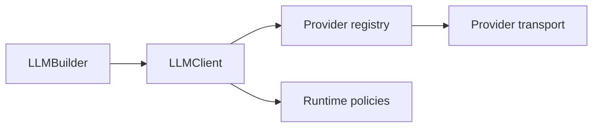

## LLM runtime map



## Start here

```python
from afk.llms import LLMBuilder

client = (
    LLMBuilder()
    .provider("openai")
    .model("gpt-4.1-mini")
    .profile("production")
    .build()
)
```

## Mental model

- provider chooses transport
- runtime policies choose execution behavior
- caller code consumes normalized contracts only
